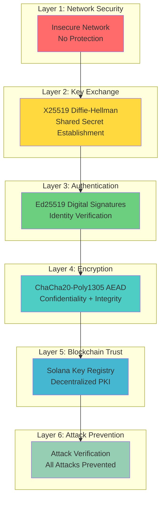

# Technical Documentation: System Overview

**Secure Channel Project - Complete System Overview**

**Version:** 1.0  
**Date:** December 2024  
**Author:** Secure Channel Project Team

---

## Table of Contents

1. [Executive Summary](#executive-summary)
2. [Project Purpose and Goals](#project-purpose-and-goals)
3. [System Components](#system-components)
4. [Project Structure](#project-structure)
5. [Technology Stack](#technology-stack)
6. [System Capabilities](#system-capabilities)
7. [Target Audience](#target-audience)

---

## Executive Summary

The Secure Channel Project is a comprehensive educational and research system that demonstrates the complete evolution of secure communication channels, from basic cryptographic key exchange to blockchain-integrated authentication systems. The project consists of six progressive phases, each building upon the previous to create a complete, production-ready secure channel implementation.

### Key Achievements

- **Complete Cryptographic Stack**: Implements X25519 key exchange, Ed25519 signatures, and ChaCha20-Poly1305 AEAD encryption
- **Attack Demonstrations**: Shows real MITM attacks and their prevention mechanisms
- **Blockchain Integration**: Integrates Solana blockchain as a decentralized key registry
- **Educational Focus**: Designed for learning with detailed explanations and visualizations
- **Production-Ready Architecture**: Modular, extensible design suitable for real-world deployment

### System Statistics

- **6 Phases**: Complete cryptographic protocol evolution
- **4 Attack Scenarios**: Comprehensive security testing
- **3 Cryptographic Primitives**: X25519, Ed25519, ChaCha20-Poly1305
- **1 Blockchain Integration**: Solana-based key registry
- **100% Attack Prevention**: All demonstrated attacks successfully prevented

---

## Project Purpose and Goals

### Primary Objectives

1. **Educational Demonstration**
   - Show how secure channels are constructed from cryptographic primitives
   - Demonstrate real-world attacks (MITM) and their mitigations
   - Explain the importance of each security layer

2. **Research Platform**
   - Provide a testbed for cryptographic protocol research
   - Enable experimentation with different security models
   - Support analysis of blockchain-based trust systems

3. **Production Reference**
   - Serve as a reference implementation for secure channel protocols
   - Demonstrate best practices in cryptographic implementation
   - Show proper integration of multiple security layers

### Learning Outcomes

By studying this system, users will understand:

- How Diffie-Hellman key exchange works and why it's vulnerable without authentication
- How digital signatures prevent man-in-the-middle attacks
- How authenticated encryption (AEAD) provides confidentiality and integrity
- How blockchain can serve as a decentralized Public Key Infrastructure (PKI)
- How to design secure systems that resist multiple attack vectors

---

## System Components

### Security Layer Diagram

The secure channel system implements defense in depth with multiple security layers:



**Security Evolution:**
- **Phase 1-2**: Only Layer 1-2 (vulnerable)
- **Phase 3**: Adds Layer 3 (authentication)
- **Phase 4**: Adds Layer 4 (encryption)
- **Phase 5**: Adds Layer 5 (blockchain)
- **Phase 6**: Verifies Layer 6 (all attacks prevented)

### 1. Cryptographic Layer

The core cryptographic functionality is organized into six phases:

**Phase 1: Basic Diffie-Hellman Key Exchange**
- X25519 elliptic curve key exchange
- HKDF-SHA256 key derivation
- Shared secret establishment

**Phase 2: Man-in-the-Middle Attack Demonstration**
- Active attacker simulation
- Key interception and replacement
- Attack success demonstration

**Phase 3: Authenticated Key Exchange**
- Ed25519 digital signatures
- Signature verification
- MITM attack prevention

**Phase 4: Secure Channel with AEAD**
- ChaCha20-Poly1305 authenticated encryption
- Nonce management
- Message integrity verification

**Phase 5: Blockchain Integration**
- Solana smart contract for key registry
- On-chain key verification
- Decentralized trust model

**Phase 6: Blockchain Attack Prevention**
- Multiple attack scenario testing
- Blockchain security property verification
- Complete attack prevention demonstration

### 2. Backend Server

**Flask-based REST API** (`backend/app.py`)
- RESTful endpoints for each phase
- JSON response formatting
- Frontend file serving
- Error handling and logging

**Key Features:**
- Modular phase execution
- Structured JSON responses
- Step-by-step execution tracking
- Visualization data generation

### 3. Frontend Interface

**Web-based User Interface** (`frontend/`)
- Interactive phase execution buttons
- Real-time result visualization
- Chart.js-based data visualization
- Responsive design

**Key Features:**
- Dynamic content rendering
- Status indicators (pending/running/success/error)
- Step-by-step information display
- Interactive charts and graphs

### 4. Blockchain Integration

**Solana Smart Contract** (`phases/phase5_solana/solana_registry/`)
- Anchor framework implementation
- Key registration and verification
- PDA (Program Derived Address) management

**Python Client** (`phases/phase5_solana/solana_registry_client.py`)
- Solana RPC client integration
- Transaction building and signing
- Account data retrieval

---

## Project Structure

```
secure_channel/
├── README.md                          # Main project documentation
├── requirements.txt                   # Python dependencies
├── run.bat / run.sh                   # Quick launchers
│
├── phases/                            # Cryptographic implementations
│   ├── phase1_dh/
│   │   └── dh_exchange.py            # Basic DH key exchange
│   ├── phase2_mitm/
│   │   └── mallory_attack.py          # MITM attack demonstration
│   ├── phase3_auth/
│   │   └── authenticated_dh.py       # Authenticated key exchange
│   ├── phase4_aead/
│   │   └── secure_channel.py         # Complete secure channel
│   ├── phase5_solana/
│   │   ├── solana_registry/          # Solana smart contract
│   │   │   ├── src/lib.rs            # Rust/Anchor code
│   │   │   ├── Cargo.toml            # Rust dependencies
│   │   │   └── Anchor.toml           # Anchor configuration
│   │   └── solana_registry_client.py # Python client
│   ├── phase6_blockchain_attack/
│   │   └── blockchain_mitm_attack.py # Blockchain attack tests
│   └── visualizations/
│       └── diagram_generator.py      # Diagram generation utilities
│
├── backend/
│   └── app.py                        # Flask API server
│
├── frontend/
│   ├── templates/
│   │   └── index.html                # Main UI template
│   └── static/
│       ├── main.js                   # Frontend JavaScript
│       └── style.css                 # Styling
│
├── scripts/
│   ├── demo_all_phases.py           # Run all phases sequentially
│   ├── test_env.py                  # Environment verification
│   └── run.bat / run.sh / run.ps1   # Detailed launchers
│
└── docs/                             # Documentation
    ├── TECHNICAL_DOC_*.md            # Technical documentation (this series)
    ├── PHASE*_DETAILED.md            # Phase-specific documentation
    ├── ARCHITECTURE.md               # Architecture overview
    └── [other documentation files]
```

---

## Technology Stack

### Cryptography Libraries

| Library | Version | Purpose |
|---------|---------|---------|
| `cryptography` | ≥41.0.0 | X25519, Ed25519, ChaCha20-Poly1305, HKDF |
| `pynacl` | ≥1.5.0 | Additional NaCl primitives (optional) |

### Blockchain Libraries

| Library | Version | Purpose |
|---------|---------|---------|
| `solana` | ≥0.30.0 | Solana blockchain client |
| `anchorpy` | ≥0.18.0 | Anchor framework Python bindings |
| `solders` | Latest | Solana SDK components |

### Web Framework

| Technology | Purpose |
|------------|---------|
| Flask | Backend web server and REST API |
| Flask-CORS | Cross-origin resource sharing |
| Chart.js | Client-side data visualization |
| HTML5/CSS3/ES6 | Frontend UI |

### Development Tools

| Tool | Purpose |
|------|---------|
| Python 3.10+ | Runtime environment |
| Rust 1.70+ | Solana smart contract compilation |
| Anchor Framework | Solana program development |
| Git | Version control |

---

## System Capabilities

### Cryptographic Operations

1. **Key Generation**
   - X25519 keypairs for key exchange
   - Ed25519 keypairs for digital signatures
   - Secure random number generation

2. **Key Exchange**
   - Diffie-Hellman key exchange (X25519)
   - Shared secret derivation (HKDF-SHA256)
   - Forward secrecy support (ephemeral keys)

3. **Digital Signatures**
   - Ed25519 signature generation
   - Signature verification
   - Message authentication

4. **Authenticated Encryption**
   - ChaCha20-Poly1305 encryption
   - Message integrity verification
   - Nonce management

5. **Blockchain Operations**
   - Key registration on Solana
   - On-chain key verification
   - Transaction signing and submission

### Security Features

1. **Attack Prevention**
   - MITM attack prevention via signatures
   - Tampering detection via AEAD
   - Impersonation prevention via blockchain

2. **Security Properties**
   - Confidentiality (encryption)
   - Integrity (MAC/authentication tag)
   - Authenticity (signatures)
   - Non-repudiation (blockchain records)

3. **Trust Model**
   - Decentralized key registry
   - Wallet ownership verification
   - Immutable key records

### User Interface Features

1. **Interactive Execution**
   - Phase-by-phase execution
   - Real-time status updates
   - Step-by-step information display

2. **Visualization**
   - Key comparison charts
   - Attack flow diagrams
   - Security status indicators

3. **Educational Content**
   - Detailed explanations
   - Technical specifications
   - Security analysis

---

## Target Audience

### Primary Audience

1. **Cryptography Students**
   - Learning cryptographic protocols
   - Understanding security properties
   - Studying attack and defense mechanisms

2. **Security Researchers**
   - Analyzing protocol security
   - Testing attack scenarios
   - Evaluating blockchain-based trust models

3. **Software Developers**
   - Implementing secure channels
   - Integrating cryptographic libraries
   - Building blockchain applications

### Secondary Audience

1. **Security Engineers**
   - Reviewing implementation practices
   - Understanding system architecture
   - Evaluating security properties

2. **Blockchain Developers**
   - Learning Solana integration
   - Understanding smart contract security
   - Studying decentralized PKI

3. **Educators**
   - Teaching cryptography
   - Demonstrating security concepts
   - Providing hands-on examples

---

## System Requirements

### Runtime Requirements

- **Python**: 3.10 or higher
- **Rust**: 1.70 or higher (for Solana contract compilation)
- **Node.js**: Not required (Chart.js via CDN)
- **Internet**: Required for Phase 5 (Solana network access)

### Dependencies

All dependencies are listed in `requirements.txt` and can be installed via:

```bash
pip install -r requirements.txt
```

### Platform Support

- **Windows**: Full support (tested on Windows 10/11)
- **macOS**: Full support (tested on macOS 12+)
- **Linux**: Full support (tested on Ubuntu 20.04+)

---

## Next Steps

After reading this overview, proceed to:

1. **TECHNICAL_DOC_02_ARCHITECTURE.md** - Detailed architecture documentation
2. **TECHNICAL_DOC_03_PROTOCOL_DESIGNS.md** - Protocol specifications and designs
3. **TECHNICAL_DOC_04_THREAT_MODEL.md** - Security threat analysis
4. **TECHNICAL_DOC_05_CODE_DOCUMENTATION.md** - Complete code documentation
5. **TECHNICAL_DOC_06_DEMO_OUTPUTS.md** - Example outputs and demonstrations
6. **TECHNICAL_DOC_07_DESIGN_RATIONALE.md** - Design decisions and rationale
7. **TECHNICAL_DOC_08_BLOCKCHAIN_ANALYSIS.md** - Blockchain integration details

---

**Document Version:** 1.0  
**Last Updated:** December 2024  
**Maintained By:** Secure Channel Project Team

