# Technical Documentation: Architecture

**Secure Channel Project - Complete Architecture Documentation**

**Version:** 1.0  
**Date:** December 2024

---

## Table of Contents

1. [High-Level Architecture](#high-level-architecture)
2. [Component Architecture](#component-architecture)
3. [Data Flow and Interactions](#data-flow-and-interactions)
4. [Module Responsibilities](#module-responsibilities)
5. [Data Schemas](#data-schemas)
6. [Trust Model and Boundaries](#trust-model-and-boundaries)
7. [Blockchain Integration Architecture](#blockchain-integration-architecture)
8. [System Interactions](#system-interactions)

---

## High-Level Architecture

### System Layers

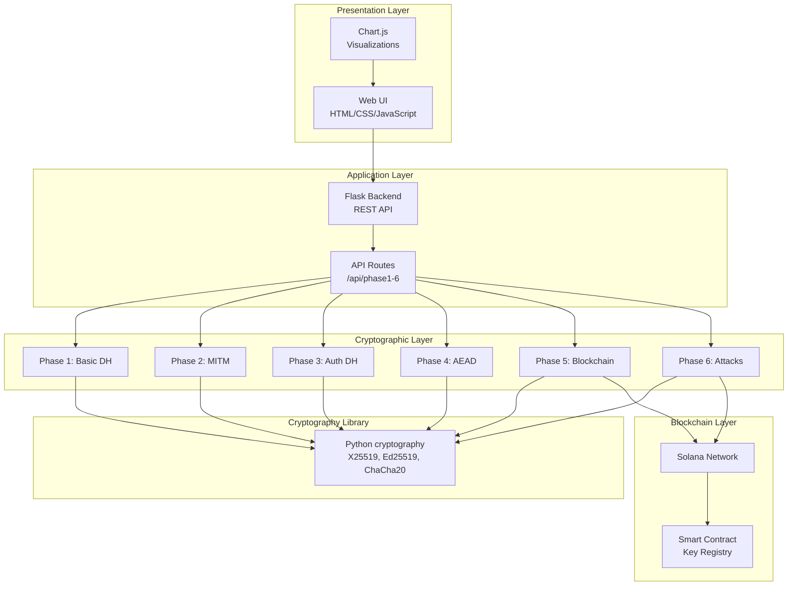

### Architecture Principles

1. **Modularity**: Each phase is a self-contained module
2. **Layering**: Clear separation between presentation, application, and cryptographic layers
3. **Reusability**: Common functions shared across phases
4. **Extensibility**: Easy to add new phases or modify existing ones
5. **Security**: Defense in depth with multiple security layers

---

## Component Architecture

### 1. Frontend Components

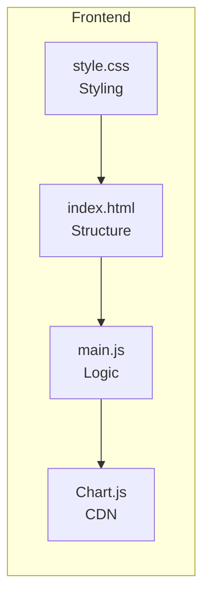

**Responsibilities:**
- User interface rendering
- API request handling
- Result visualization
- Status management

### 2. Backend Components

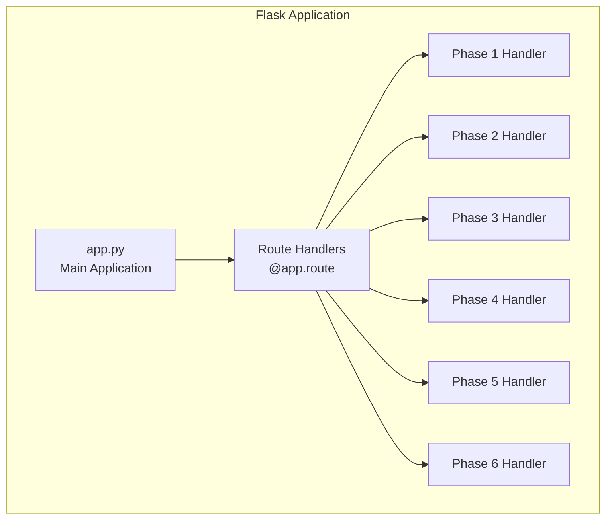

**Responsibilities:**
- HTTP request handling
- Phase execution orchestration
- JSON response formatting
- Error handling

### 3. Cryptographic Phase Modules

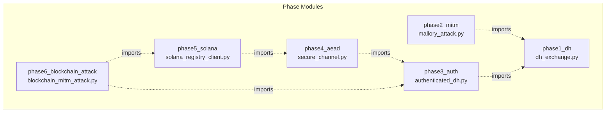

**Dependencies:**
- Phase 2 imports Phase 1 functions
- Phase 3 imports Phase 1 functions
- Phase 4 imports Phase 3 classes
- Phase 5 imports Phase 4 classes
- Phase 6 imports Phase 3 and Phase 5

### 4. Blockchain Components

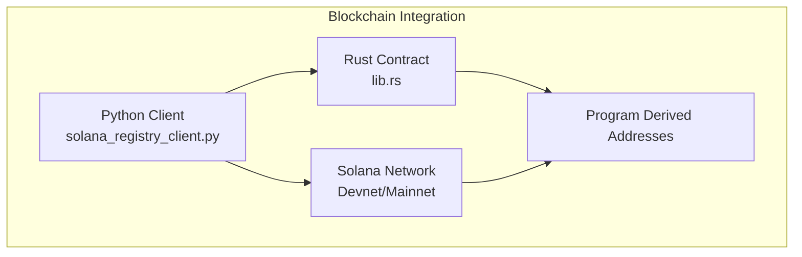

**Responsibilities:**
- Key registration on-chain
- Key verification queries
- Transaction building and signing
- Account data retrieval

---

## Data Flow and Interactions

### Request Flow

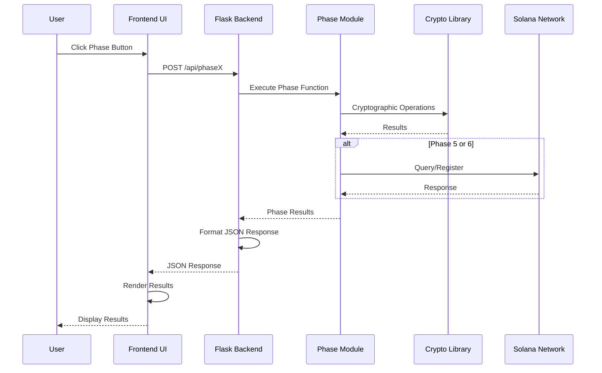

### Phase Execution Flow

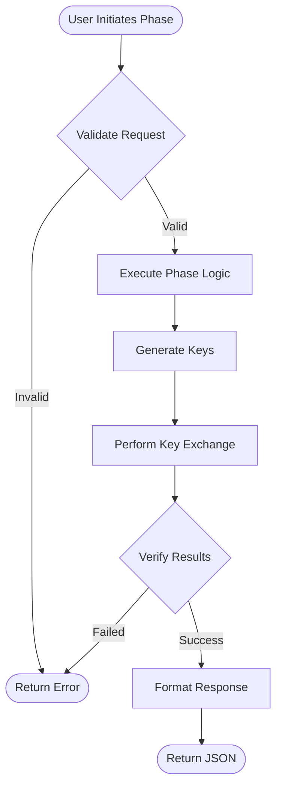

---

## Module Responsibilities

### Phase 1: Basic Diffie-Hellman (`phase1_dh/dh_exchange.py`)

**Functions:**
- `generate_x25519_keypair()`: Generate X25519 keypair
- `public_bytes()`: Serialize public key to bytes
- `derive_shared_key()`: Perform DH exchange and derive key

**Responsibilities:**
- Key generation
- Key exchange execution
- Shared secret derivation via HKDF

**Dependencies:**
- `cryptography.hazmat.primitives.asymmetric.x25519`
- `cryptography.hazmat.primitives.kdf.hkdf`

### Phase 2: MITM Attack (`phase2_mitm/mallory_attack.py`)

**Classes:**
- `Participant`: Legitimate participant
- `Mallory`: MITM attacker

**Responsibilities:**
- Simulate MITM attack
- Demonstrate vulnerability
- Show attack success

**Dependencies:**
- Imports Phase 1 functions
- `cryptography` library

### Phase 3: Authenticated DH (`phase3_auth/authenticated_dh.py`)

**Classes:**
- `AuthenticatedParticipant`: Participant with signatures
- `AuthenticatedMallory`: Attacker (fails)

**Responsibilities:**
- Ed25519 signature generation
- Signature verification
- MITM attack prevention

**Dependencies:**
- Imports Phase 1 functions
- `cryptography.hazmat.primitives.asymmetric.ed25519`

### Phase 4: Secure Channel (`phase4_aead/secure_channel.py`)

**Classes:**
- `AuthenticatedParticipant`: From Phase 3
- `SecureChannel`: Complete secure channel

**Responsibilities:**
- ChaCha20-Poly1305 encryption
- Message authentication
- Nonce management

**Dependencies:**
- Imports Phase 3 classes
- `cryptography.hazmat.primitives.ciphers.aead`

### Phase 5: Blockchain Integration (`phase5_solana/`)

**Components:**
- `SolanaKeyRegistryClient`: Python client
- `SecureChannelWithBlockchain`: Extended secure channel
- Smart Contract (`lib.rs`): On-chain registry

**Responsibilities:**
- Key registration on Solana
- On-chain key verification
- Blockchain transaction handling

**Dependencies:**
- `solana` Python library
- `anchorpy` for Anchor integration
- Solana network access

### Phase 6: Blockchain Attacks (`phase6_blockchain_attack/blockchain_mitm_attack.py`)

**Classes:**
- `BlockchainRegistry`: Simulated blockchain
- `BlockchainMallory`: Attacker attempting blockchain attacks

**Responsibilities:**
- Attack scenario testing
- Blockchain security verification
- Attack prevention demonstration

**Dependencies:**
- Imports Phase 3 and Phase 5 components

---

## Data Schemas

### 1. Diffie-Hellman Message (Phase 1)

```python
DHMessage = {
    "public_key": bytes,  # 32 bytes, X25519 public key
}
```

**Serialization:**
- Raw bytes format (32 bytes)
- No encoding wrapper
- Direct transmission

### 2. Authenticated DH Message (Phase 3)

```python
AuthenticatedDHMessage = {
    "dh_public_key": bytes,        # 32 bytes, X25519 public key
    "signing_public_key": bytes,    # 32 bytes, Ed25519 public key
    "signature": bytes,             # 64 bytes, Ed25519 signature
}
```

**Structure:**
- DH public key: Ephemeral key for key exchange
- Signing public key: Long-term identity key
- Signature: Proof of authenticity

### 3. AEAD Message (Phase 4)

```python
AEADMessage = {
    "ciphertext": bytes,  # Variable length, encrypted data + 16-byte tag
    "nonce": bytes,       # 12 bytes, unique nonce
    "associated_data": bytes,  # Optional, authenticated but not encrypted
}
```

**Structure:**
- Ciphertext: Encrypted plaintext + Poly1305 authentication tag (16 bytes)
- Nonce: 12-byte unique value (can be public)
- Associated data: Optional metadata (authenticated but not encrypted)

### 4. Blockchain Key Record (Phase 5)

```rust
// Solana Account Structure
pub struct KeyRecord {
    pub owner: Pubkey,        // 32 bytes, Solana wallet address
    pub public_key: [u8; 32],  // 32 bytes, Ed25519 public key
    pub bump: u8,             // 1 byte, PDA bump seed
}
```

**Total Size:** 65 bytes (8-byte discriminator + 32 + 32 + 1)

### 5. API Response Schema

```json
{
    "success": boolean,
    "phase": integer,
    "title": string,
    "steps": [
        {
            "step": integer,
            "title": string,
            "description": string,
            "details": object
        }
    ],
    "data": {
        "alice": object,
        "bob": object,
        "mallory": object  // Optional
    },
    "visualization": object,
    "summary": string
}
```

---

## Trust Model and Boundaries

### Trust Boundaries

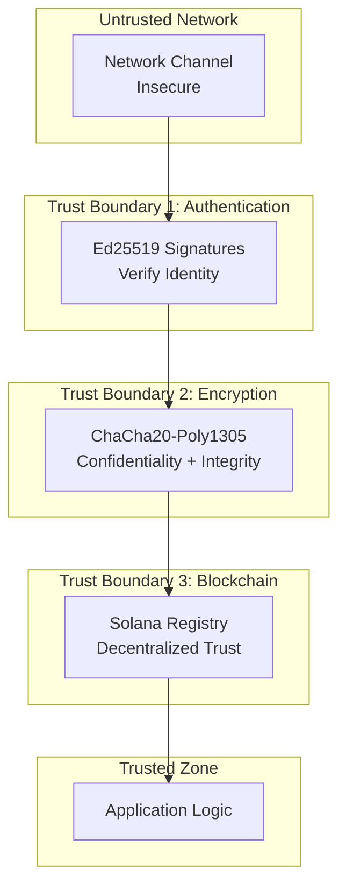

### Trust Assumptions

1. **Cryptographic Primitives**
   - X25519: Secure against discrete log attacks
   - Ed25519: Secure against signature forgery
   - ChaCha20-Poly1305: Secure against chosen-ciphertext attacks

2. **Key Management**
   - Private keys are kept secret
   - Public keys are distributed correctly
   - Long-term keys are stored securely

3. **Blockchain**
   - Solana network is honest majority
   - Smart contract code is correct
   - Wallet ownership cannot be forged

4. **System Environment**
   - Python cryptography library is correct
   - Random number generation is secure
   - No side-channel attacks

### Trust Evolution Across Phases

| Phase | Trust Model | Trust Boundary |
|-------|------------|----------------|
| Phase 1 | None | No authentication |
| Phase 2 | None | Attack succeeds |
| Phase 3 | Signature-based | Ed25519 signatures |
| Phase 4 | Signature + AEAD | Signatures + encryption |
| Phase 5 | Blockchain + Signature + AEAD | Decentralized registry |
| Phase 6 | Verified blockchain | All attacks prevented |

---

## Blockchain Integration Architecture

### Solana Smart Contract Architecture

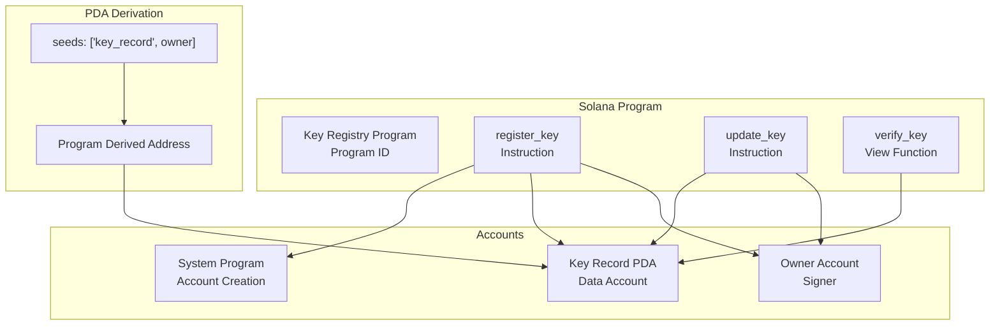

### PDA (Program Derived Address) Derivation

```rust
// Seeds for PDA derivation
seeds = [b"key_record", owner_pubkey.as_ref()]

// Derive PDA
let (pda, bump) = Pubkey::find_program_address(seeds, program_id);
```

**Properties:**
- Deterministic address generation
- No private key required
- Program-controlled account
- Unique per owner

### Client-Server Interaction

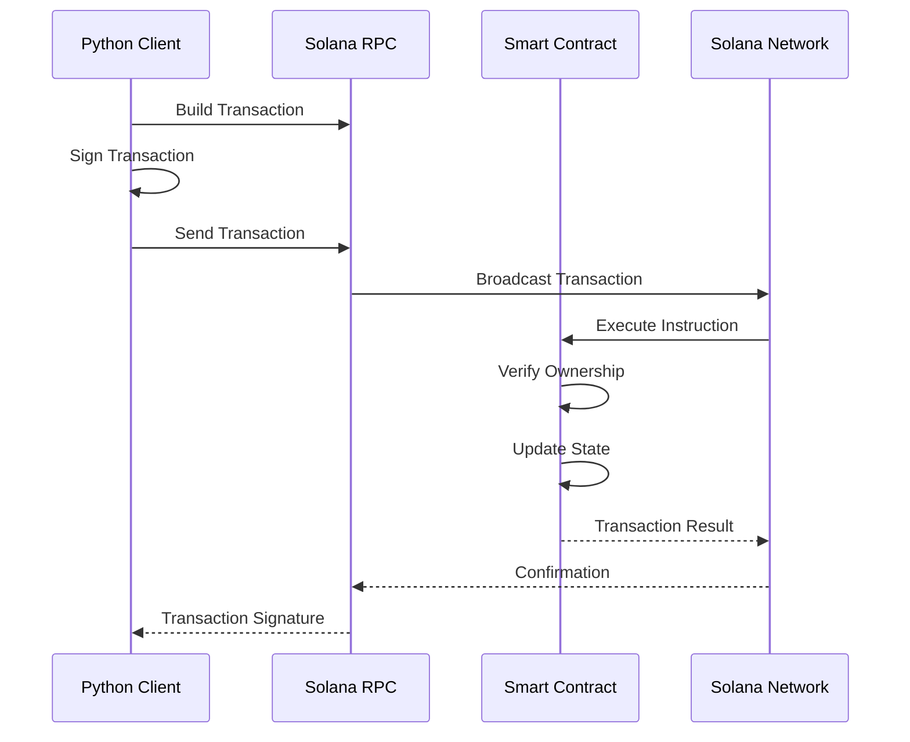

---

## System Interactions

### Phase Execution Interaction

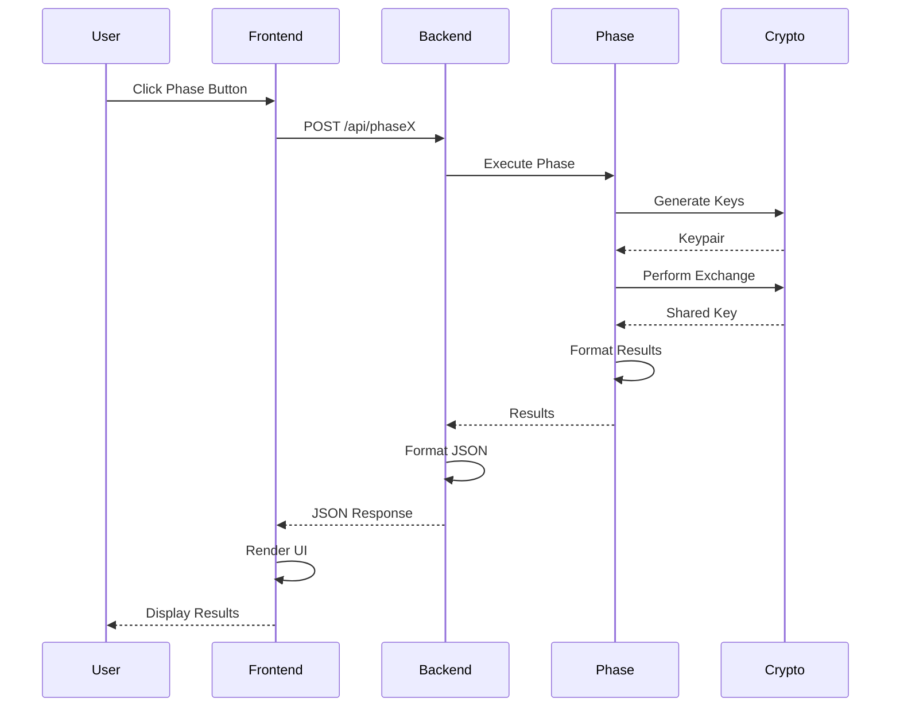

### Cross-Phase Dependencies

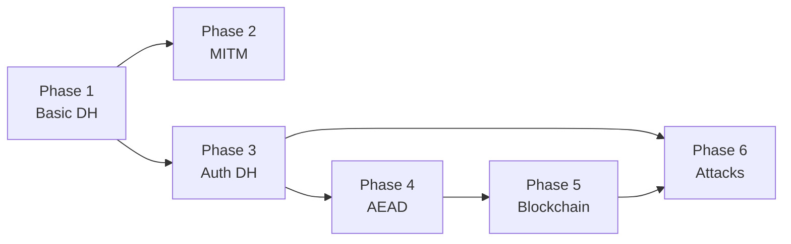

**Dependency Rules:**
- Phase 2 depends on Phase 1
- Phase 3 depends on Phase 1
- Phase 4 depends on Phase 3
- Phase 5 depends on Phase 4
- Phase 6 depends on Phase 3 and Phase 5

---

## Security Architecture

### Defense in Depth

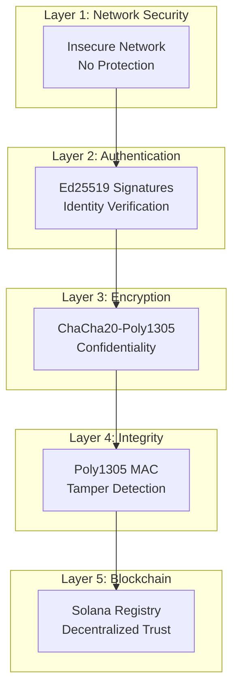

### Security Properties by Phase

| Phase | Confidentiality | Integrity | Authentication | Non-Repudiation |
|-------|----------------|-----------|---------------|-----------------|
| Phase 1 | ❌ | ❌ | ❌ | ❌ |
| Phase 2 | ❌ | ❌ | ❌ | ❌ |
| Phase 3 | ❌ | ✅ | ✅ | ✅ |
| Phase 4 | ✅ | ✅ | ✅ | ✅ |
| Phase 5 | ✅ | ✅ | ✅ | ✅ |
| Phase 6 | ✅ | ✅ | ✅ | ✅ |

---

## Performance Architecture

### Execution Time Breakdown

| Phase | Key Generation | Key Exchange | Signatures | Encryption | Blockchain | Total |
|-------|---------------|--------------|------------|------------|------------|-------|
| Phase 1 | 5ms | 3ms | - | - | - | ~8ms |
| Phase 2 | 10ms | 6ms | - | - | - | ~16ms |
| Phase 3 | 10ms | 3ms | 5ms | - | - | ~18ms |
| Phase 4 | 10ms | 3ms | 5ms | 2ms | - | ~20ms |
| Phase 5 | 10ms | 3ms | 5ms | 2ms | 2000ms | ~2020ms |
| Phase 6 | 15ms | 6ms | 10ms | - | 100ms | ~131ms |

### Resource Usage

- **Memory**: < 50MB for all phases
- **CPU**: Minimal (cryptographic operations are fast)
- **Network**: Only Phase 5 requires internet (Solana RPC)
- **Storage**: Minimal (no persistent storage required)

---

## Extension Points

### Adding New Phases

1. Create phase directory: `phases/phaseX_name/`
2. Implement phase logic: `phaseX_name/implementation.py`
3. Add backend route: `backend/app.py` → `@app.route('/api/phaseX')`
4. Add frontend handler: `frontend/static/main.js` → `displayPhaseXResults()`
5. Update UI: `frontend/templates/index.html` → Add phase button

### Modifying Existing Phases

- **Change algorithms**: Update imports and function calls
- **Add features**: Extend classes, update API responses
- **Modify UI**: Update HTML/CSS/JavaScript

---

## End-to-End Pipeline

### Complete Data Flow Pipeline

The following diagram shows the complete end-to-end pipeline from user interaction to secure message delivery:

```mermaid
flowchart LR
    subgraph "User Interaction"
        User[User Clicks Phase Button]
    end
    
    subgraph "Frontend Layer"
        UI[Web UI<br/>JavaScript]
        API[API Request<br/>POST /api/phaseX]
    end
    
    subgraph "Backend Layer"
        Flask[Flask Server<br/>Route Handler]
        Phase[Phase Module<br/>Execution]
    end
    
    subgraph "Cryptographic Operations"
        KeyGen[Key Generation<br/>X25519/Ed25519]
        KeyEx[Key Exchange<br/>DH + HKDF]
        Sign[Signing<br/>Ed25519]
        Verify[Verification<br/>Ed25519]
        Encrypt[Encryption<br/>ChaCha20-Poly1305]
    end
    
    subgraph "Blockchain Layer"
        Reg[Key Registration<br/>Solana Transaction]
        Query[Key Verification<br/>On-Chain Query]
    end
    
    subgraph "Response Pipeline"
        Format[JSON Formatting<br/>Results + Steps]
        Viz[Visualization Data<br/>Chart.js Data]
        Response[JSON Response]
    end
    
    subgraph "Display Layer"
        Render[UI Rendering<br/>Charts + Steps]
        Display[User Views Results]
    end
    
    User --> UI
    UI --> API
    API --> Flask
    Flask --> Phase
    Phase --> KeyGen
    KeyGen --> KeyEx
    KeyEx --> Sign
    Sign --> Verify
    Verify --> Encrypt
    Encrypt --> Reg
    Reg --> Query
    Query --> Format
    Format --> Viz
    Viz --> Response
    Response --> Render
    Render --> Display
    
    style User fill:#e1f5ff
    style Display fill:#e1f5ff
    style KeyGen fill:#fff4e1
    style KeyEx fill:#fff4e1
    style Sign fill:#fff4e1
    style Verify fill:#fff4e1
    style Encrypt fill:#fff4e1
    style Reg fill:#e8f5e9
    style Query fill:#e8f5e9
```

### Pipeline Stages

1. **User Interaction**: User initiates phase execution
2. **Frontend Request**: JavaScript sends API request
3. **Backend Processing**: Flask routes to phase module
4. **Cryptographic Operations**: Execute crypto primitives
5. **Blockchain Operations**: Register/verify keys (Phase 5-6)
6. **Response Formatting**: Structure results as JSON
7. **Visualization**: Generate chart data
8. **UI Rendering**: Display results to user

### Pipeline Performance

| Stage | Typical Time | Bottleneck |
|-------|--------------|------------|
| User Interaction | < 1ms | User input |
| Frontend Request | 1-5ms | Network latency |
| Backend Processing | 5-10ms | Python execution |
| Cryptographic Operations | 10-20ms | Crypto library |
| Blockchain Operations | 100-2000ms | Solana network |
| Response Formatting | 1-2ms | JSON serialization |
| UI Rendering | 5-10ms | DOM manipulation |

**Total Pipeline Time:**
- Phase 1-4: ~20-50ms
- Phase 5: ~2000-3000ms (blockchain)
- Phase 6: ~150-200ms

---

**Next Document:** TECHNICAL_DOC_03_PROTOCOL_DESIGNS.md

---

**Document Version:** 1.0  
**Last Updated:** December 2024

