# Technical Documentation: Protocol Designs

**Secure Channel Project - Complete Protocol Specifications**

**Version:** 1.0  
**Date:** December 2024

---

## Table of Contents

1. [Protocol Overview](#protocol-overview)
2. [Phase 1: Unauthenticated Diffie-Hellman Handshake](#phase-1-unauthenticated-diffie-hellman-handshake)
3. [Phase 2: MITM Attack Flow](#phase-2-mitm-attack-flow)
4. [Phase 3: Authenticated Handshake](#phase-3-authenticated-handshake)
5. [Phase 4: AEAD Secured Messaging](#phase-4-aead-secured-messaging)
6. [Phase 5: Solana Blockchain Key Verification](#phase-5-solana-blockchain-key-verification)
7. [Phase 6: Blockchain-Layer Attacks](#phase-6-blockchain-layer-attacks)
8. [Protocol Comparison](#protocol-comparison)

---

## Protocol Overview

This document describes the complete protocol designs for all six phases of the secure channel system. Each phase builds upon the previous, adding security layers incrementally.

### Protocol Evolution

```
Phase 1: Basic Key Exchange
    ↓ (vulnerable to MITM)
Phase 2: Attack Demonstration
    ↓ (shows vulnerability)
Phase 3: Authentication Added
    ↓ (prevents MITM)
Phase 4: Encryption Added
    ↓ (complete secure channel)
Phase 5: Blockchain Integration
    ↓ (decentralized trust)
Phase 6: Attack Prevention Verified
    ↓ (all attacks prevented)
```

---

## Phase 1: Unauthenticated Diffie-Hellman Handshake

### Protocol Specification

**Purpose:** Establish a shared secret between two parties using X25519 key exchange.

**Security Properties:**
- ✅ Shared secret establishment
- ❌ No authentication
- ❌ Vulnerable to MITM attacks

### Message Sequence

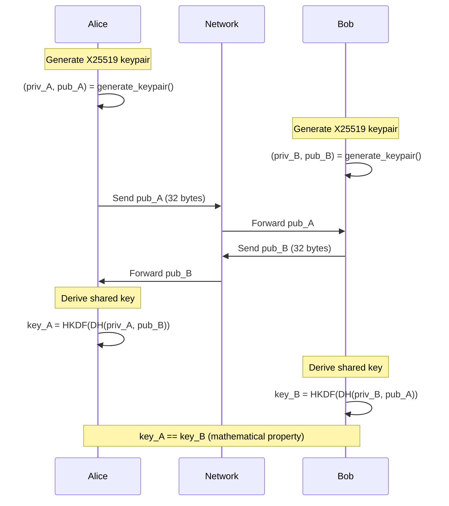
```mermaid
sequenceDiagram
    participant A as Alice
    participant N as Network
    participant B as Bob
    
    Note over A: Generate X25519 keypair
    A->>A: (priv_A, pub_A) = generate_keypair()
    
    Note over B: Generate X25519 keypair
    B->>B: (priv_B, pub_B) = generate_keypair()
    
    A->>N: Send pub_A (32 bytes)
    N->>B: Forward pub_A
    
    B->>N: Send pub_B (32 bytes)
    N->>A: Forward pub_B
    
    Note over A: Derive shared key
    A->>A: key_A = HKDF(DH(priv_A, pub_B))
    
    Note over B: Derive shared key
    B->>B: key_B = HKDF(DH(priv_B, pub_A))
    
    Note over A,B: key_A == key_B (mathematical property)
```

### Message Format

**DH Public Key Message:**
```
+------------------+
| Public Key (32B) |
+------------------+
```

**Field Descriptions:**
- `Public Key`: 32-byte X25519 public key (raw bytes, no encoding)

### Key Derivation Process

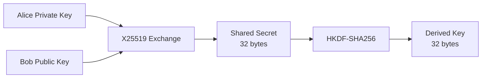
```mermaid
flowchart LR
    A[Alice Private Key] --> DH1[X25519 Exchange]
    B[Bob Public Key] --> DH1
    DH1 --> SS[Shared Secret<br/>32 bytes]
    SS --> HKDF[HKDF-SHA256]
    HKDF --> K[Derived Key<br/>32 bytes]
```

**HKDF Parameters:**
- Algorithm: SHA-256
- Length: 32 bytes (256 bits)
- Salt: None (for simplicity)
- Info: `b"secure_channel_v1"`

### Security Analysis

**Strengths:**
- Forward secrecy (ephemeral keys)
- Fast computation (X25519)
- Small key size (32 bytes)

**Vulnerabilities:**
- No authentication → MITM possible
- No key verification → Mallory can replace keys
- No identity binding → Cannot verify who you're talking to

### Failure Modes

1. **MITM Attack**: Mallory intercepts and replaces public keys
2. **Key Tampering**: No way to detect if keys were modified
3. **Impersonation**: No way to verify identity

---

## Phase 2: MITM Attack Flow

### Attack Specification

**Purpose:** Demonstrate how an unauthenticated key exchange can be compromised.

**Attack Strategy:** Mallory intercepts public keys and replaces them with her own.

### Attack Sequence

```mermaid
sequenceDiagram
    participant A as Alice
    participant M as Mallory
    participant B as Bob
    
    Note over A: Generate keypair
    A->>A: (priv_A, pub_A) = generate_keypair()
    
    A->>M: Send pub_A (intended for Bob)
    Note over M: INTERCEPT
    M->>M: Store pub_A
    M->>M: Generate fake keypair for Bob
    M->>M: (priv_MB, pub_MB) = generate_keypair()
    M->>M: key_MA = HKDF(DH(priv_MB, pub_A))
    M->>A: Send pub_MB (fake "Bob" key)
    
    Note over A: Alice thinks she's talking to Bob
    A->>A: key_A = HKDF(DH(priv_A, pub_MB))
    Note over A: key_A == key_MA (Mallory has the key!)
    
    Note over B: Generate keypair
    B->>B: (priv_B, pub_B) = generate_keypair()
    
    B->>M: Send pub_B (intended for Alice)
    Note over M: INTERCEPT
    M->>M: Store pub_B
    M->>M: Generate fake keypair for Alice
    M->>M: (priv_MA, pub_MA) = generate_keypair()
    M->>M: key_MB = HKDF(DH(priv_MA, pub_B))
    M->>B: Send pub_MA (fake "Alice" key)
    
    Note over B: Bob thinks he's talking to Alice
    B->>B: key_B = HKDF(DH(priv_B, pub_MA))
    Note over B: key_B == key_MB (Mallory has the key!)
    
    Note over A,B,M: Result: Alice ↔ Mallory ↔ Bob
    Note over M: Mallory can decrypt all messages!
```

### Attack Details

**Mallory's Strategy:**
1. Position herself between Alice and Bob (network-level attack)
2. Intercept Alice's public key
3. Generate fake keypair to impersonate Bob
4. Derive shared key with Alice
5. Forward fake "Bob" key to Alice
6. Repeat for Bob's key

**Result:**
- Alice shares key with Mallory (thinks it's Bob)
- Bob shares key with Mallory (thinks it's Alice)
- Alice and Bob have different keys
- Mallory can decrypt, read, and modify all messages

### Attack Success Conditions

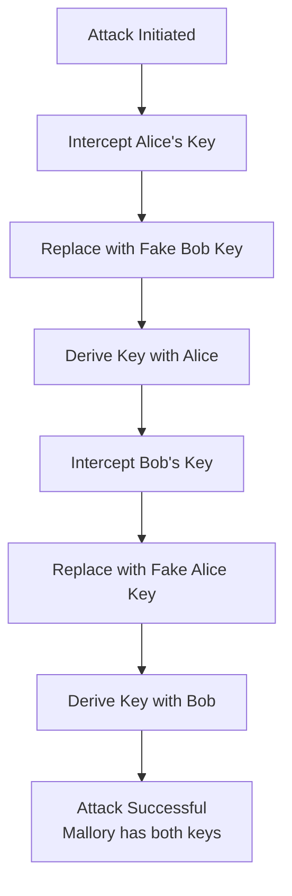
```mermaid
graph TB
    Start[Attack Initiated] --> Intercept1[Intercept Alice's Key]
    Intercept1 --> Replace1[Replace with Fake Bob Key]
    Replace1 --> Derive1[Derive Key with Alice]
    Derive1 --> Intercept2[Intercept Bob's Key]
    Intercept2 --> Replace2[Replace with Fake Alice Key]
    Replace2 --> Derive2[Derive Key with Bob]
    Derive2 --> Success[Attack Successful<br/>Mallory has both keys]
```

### Why Attack Succeeds

1. **No Authentication**: Public keys are not signed
2. **No Identity Verification**: Cannot verify who sent the key
3. **No Key Binding**: Keys are not bound to identities
4. **Passive Replacement**: Mallory can silently replace keys

---

## Phase 3: Authenticated Handshake

### Protocol Specification

**Purpose:** Add authentication to prevent MITM attacks using Ed25519 digital signatures.

**Security Properties:**
- ✅ Shared secret establishment
- ✅ Authentication (Ed25519 signatures)
- ✅ MITM attack prevention
- ❌ No message encryption yet

### Message Sequence

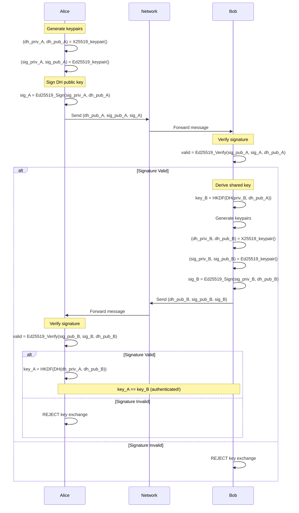
```mermaid
sequenceDiagram
    participant A as Alice
    participant N as Network
    participant B as Bob
    
    Note over A: Generate keypairs
    A->>A: (dh_priv_A, dh_pub_A) = X25519_keypair()
    A->>A: (sig_priv_A, sig_pub_A) = Ed25519_keypair()
    
    Note over A: Sign DH public key
    A->>A: sig_A = Ed25519_Sign(sig_priv_A, dh_pub_A)
    
    A->>N: Send (dh_pub_A, sig_pub_A, sig_A)
    N->>B: Forward message
    
    Note over B: Verify signature
    B->>B: valid = Ed25519_Verify(sig_pub_A, sig_A, dh_pub_A)
    alt Signature Valid
        Note over B: Derive shared key
        B->>B: key_B = HKDF(DH(priv_B, dh_pub_A))
        B->>B: Generate keypairs
        B->>B: (dh_priv_B, dh_pub_B) = X25519_keypair()
        B->>B: (sig_priv_B, sig_pub_B) = Ed25519_keypair()
        B->>B: sig_B = Ed25519_Sign(sig_priv_B, dh_pub_B)
        B->>N: Send (dh_pub_B, sig_pub_B, sig_B)
        N->>A: Forward message
        Note over A: Verify signature
        A->>A: valid = Ed25519_Verify(sig_pub_B, sig_B, dh_pub_B)
        alt Signature Valid
            A->>A: key_A = HKDF(DH(dh_priv_A, dh_pub_B))
            Note over A,B: key_A == key_B (authenticated!)
        else Signature Invalid
            A->>A: REJECT key exchange
        end
    else Signature Invalid
        B->>B: REJECT key exchange
    end
```

### Message Format

**Authenticated DH Message:**
```
+----------------------+
| DH Public Key (32B)  |
+----------------------+
| Signing Public (32B) |
+----------------------+
| Signature (64B)      |
+----------------------+
Total: 128 bytes
```

**Field Descriptions:**
- `DH Public Key`: 32-byte X25519 public key (ephemeral)
- `Signing Public Key`: 32-byte Ed25519 public key (long-term identity)
- `Signature`: 64-byte Ed25519 signature over DH public key

### Signature Generation

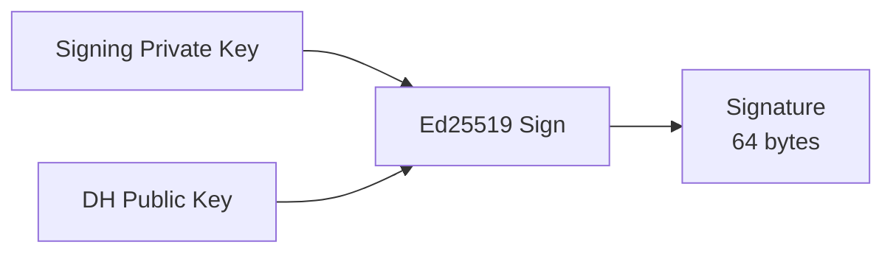
```mermaid
flowchart LR
    SK[Signing Private Key] --> Sign[Ed25519 Sign]
    DHPK[DH Public Key] --> Sign
    Sign --> Sig[Signature<br/>64 bytes]
```

**Signature Algorithm:**
- Algorithm: Ed25519 (Edwards-curve Digital Signature Algorithm)
- Input: DH public key (32 bytes)
- Output: Signature (64 bytes)
- Security: 128-bit security level

### Signature Verification

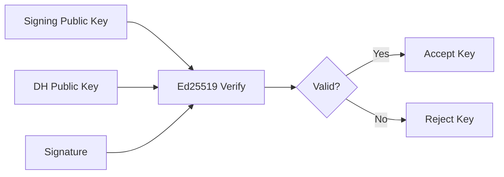
```mermaid
flowchart LR
    SPK[Signing Public Key] --> Verify[Ed25519 Verify]
    DHPK[DH Public Key] --> Verify
    Sig[Signature] --> Verify
    Verify --> Result{Valid?}
    Result -->|Yes| Accept[Accept Key]
    Result -->|No| Reject[Reject Key]
```

### MITM Attack Prevention

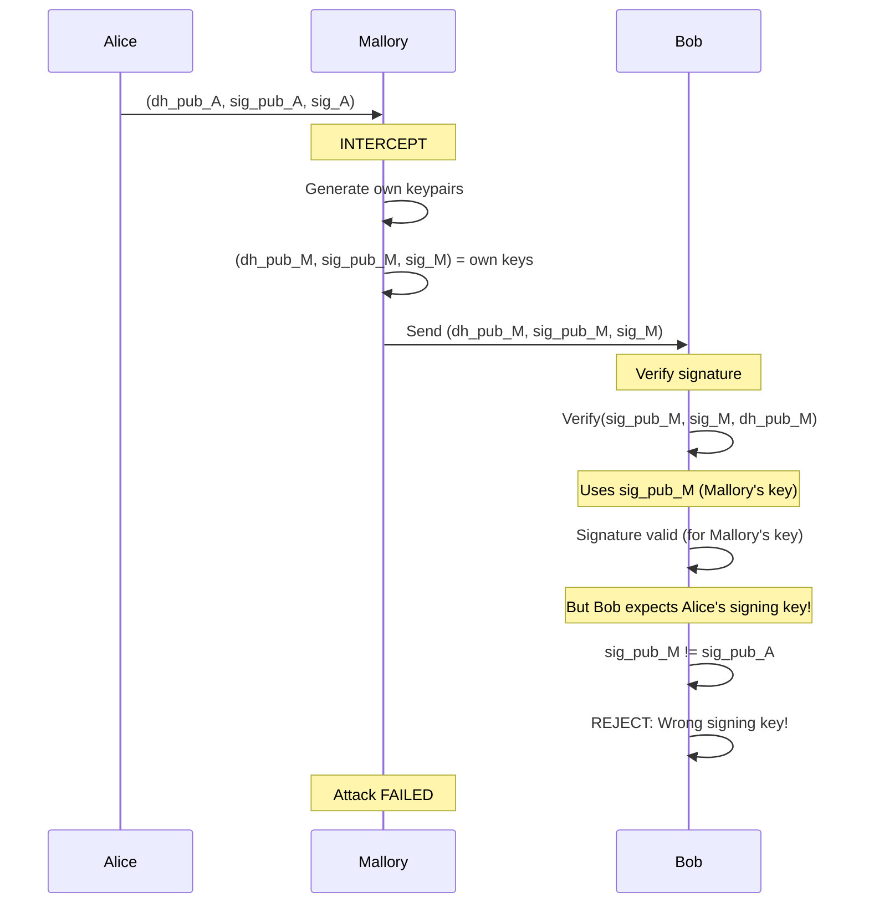
```mermaid
sequenceDiagram
    participant A as Alice
    participant M as Mallory
    participant B as Bob
    
    A->>M: (dh_pub_A, sig_pub_A, sig_A)
    Note over M: INTERCEPT
    M->>M: Generate own keypairs
    M->>M: (dh_pub_M, sig_pub_M, sig_M) = own keys
    M->>B: Send (dh_pub_M, sig_pub_M, sig_M)
    
    Note over B: Verify signature
    B->>B: Verify(sig_pub_M, sig_M, dh_pub_M)
    Note over B: Uses sig_pub_M (Mallory's key)
    B->>B: Signature valid (for Mallory's key)
    
    Note over B: But Bob expects Alice's signing key!
    B->>B: sig_pub_M != sig_pub_A
    B->>B: REJECT: Wrong signing key!
    
    Note over M: Attack FAILED
```

**Why Attack Fails:**
- Mallory cannot forge Alice's signature without Alice's private key
- Bob verifies signature using Alice's known public key
- Mismatch detected → Key exchange rejected

### Failure Modes

1. **Signature Verification Failure**: Invalid signature → Reject
2. **Wrong Signing Key**: Different public key → Reject
3. **Key Tampering**: Modified DH key → Signature invalid → Reject

---

## Phase 4: AEAD Secured Messaging

### Protocol Specification

**Purpose:** Add authenticated encryption for secure message exchange.

**Security Properties:**
- ✅ Confidentiality (ChaCha20 encryption)
- ✅ Integrity (Poly1305 MAC)
- ✅ Authentication (Ed25519 signatures + MAC)
- ✅ Replay protection (unique nonces)

### Message Exchange Sequence

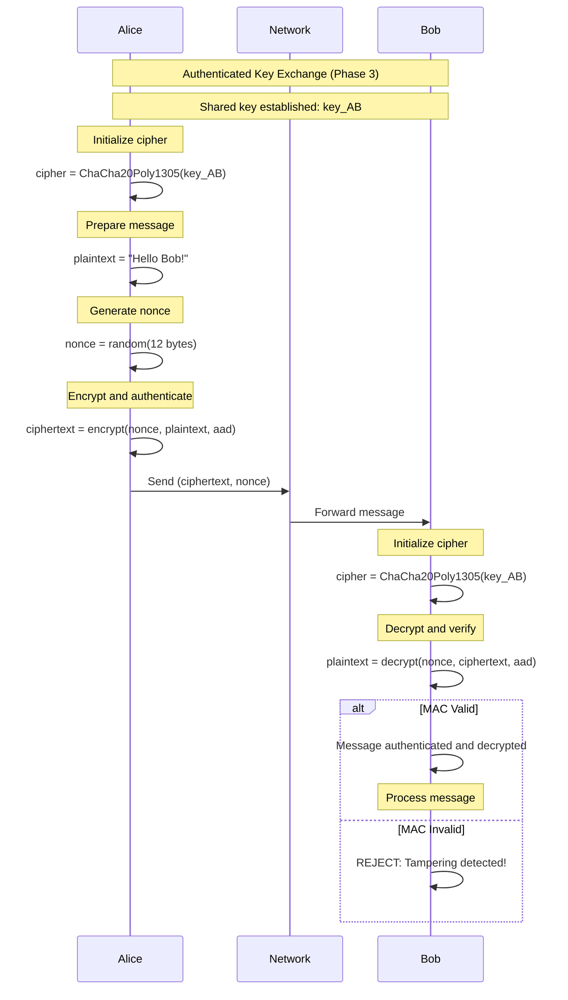
```mermaid
sequenceDiagram
    participant A as Alice
    participant N as Network
    participant B as Bob
    
    Note over A,B: Authenticated Key Exchange (Phase 3)
    Note over A,B: Shared key established: key_AB
    
    Note over A: Initialize cipher
    A->>A: cipher = ChaCha20Poly1305(key_AB)
    
    Note over A: Prepare message
    A->>A: plaintext = "Hello Bob!"
    
    Note over A: Generate nonce
    A->>A: nonce = random(12 bytes)
    
    Note over A: Encrypt and authenticate
    A->>A: ciphertext = encrypt(nonce, plaintext, aad)
    
    A->>N: Send (ciphertext, nonce)
    N->>B: Forward message
    
    Note over B: Initialize cipher
    B->>B: cipher = ChaCha20Poly1305(key_AB)
    
    Note over B: Decrypt and verify
    B->>B: plaintext = decrypt(nonce, ciphertext, aad)
    alt MAC Valid
        B->>B: Message authenticated and decrypted
        Note over B: Process message
    else MAC Invalid
        B->>B: REJECT: Tampering detected!
    end
```

### Encryption Process

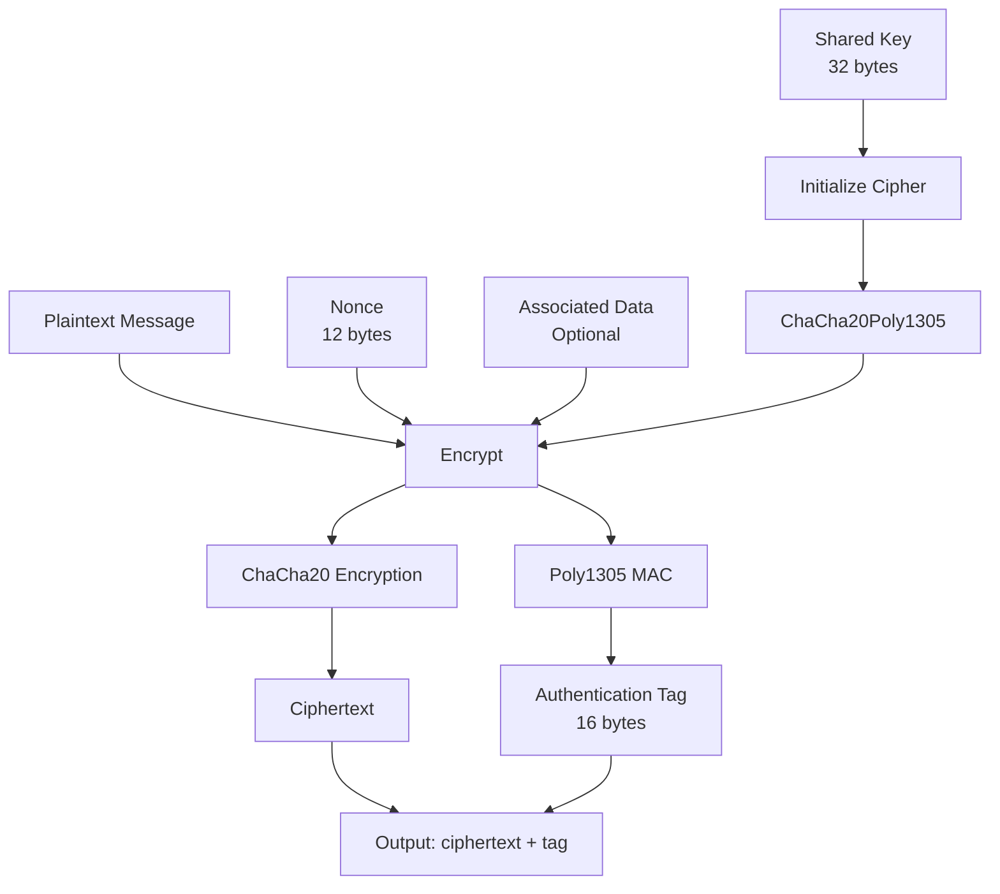
```mermaid
flowchart TB
    Key[Shared Key<br/>32 bytes] --> Init[Initialize Cipher]
    Init --> Cipher[ChaCha20Poly1305]
    
    Plaintext[Plaintext Message] --> Encrypt[Encrypt]
    Nonce[Nonce<br/>12 bytes] --> Encrypt
    AAD[Associated Data<br/>Optional] --> Encrypt
    Cipher --> Encrypt
    
    Encrypt --> ChaCha[ChaCha20 Encryption]
    Encrypt --> Poly[Poly1305 MAC]
    
    ChaCha --> CT[Ciphertext]
    Poly --> Tag[Authentication Tag<br/>16 bytes]
    
    CT --> Output[Output: ciphertext + tag]
    Tag --> Output
```

### Message Format

**AEAD Encrypted Message:**
```
+------------------+
| Ciphertext (N+16)|
+------------------+
| Nonce (12B)      |
+------------------+
| AAD (optional)   |
+------------------+
```

**Field Descriptions:**
- `Ciphertext`: Encrypted plaintext + 16-byte Poly1305 tag
- `Nonce`: 12-byte unique nonce (can be public)
- `AAD`: Associated data (authenticated but not encrypted)

### Nonce Management

**Critical Requirement:** Nonce MUST be unique for each encryption with the same key.

**Nonce Generation Strategy:**
```python
nonce = struct.pack('>Q', counter) + os.urandom(4)
# 8 bytes counter + 4 bytes random = 12 bytes total
```

**Properties:**
- Counter ensures sequential uniqueness
- Random bytes add entropy
- Prevents nonce reuse

### Decryption and Verification

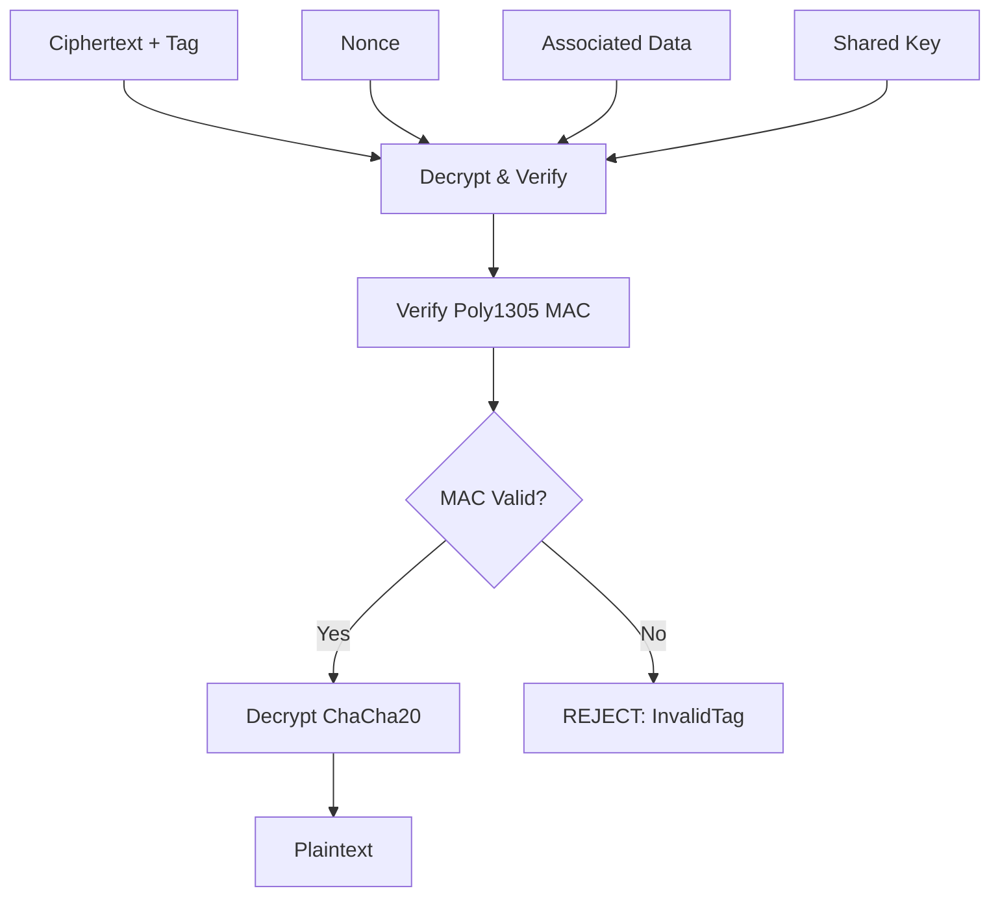
```mermaid
flowchart TB
    Ciphertext[Ciphertext + Tag] --> Decrypt[Decrypt & Verify]
    Nonce[Nonce] --> Decrypt
    AAD[Associated Data] --> Decrypt
    Key[Shared Key] --> Decrypt
    
    Decrypt --> VerifyMAC[Verify Poly1305 MAC]
    VerifyMAC --> Valid{MAC Valid?}
    
    Valid -->|Yes| DecryptChaCha[Decrypt ChaCha20]
    Valid -->|No| Reject[REJECT: InvalidTag]
    
    DecryptChaCha --> Plaintext[Plaintext]
```

### Tampering Detection

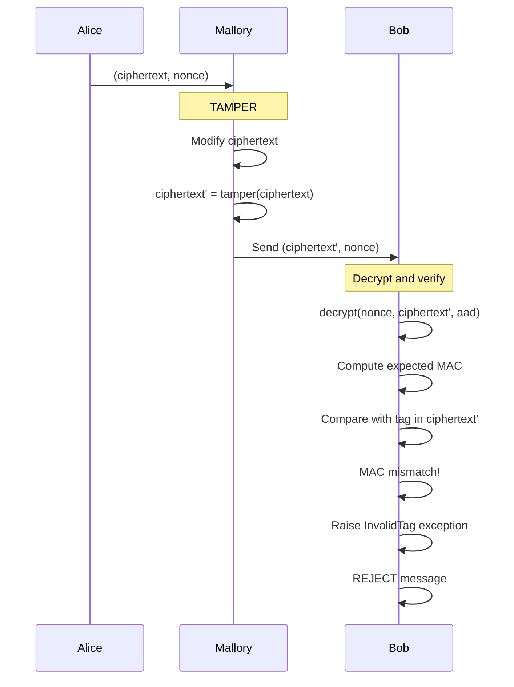
```mermaid
sequenceDiagram
    participant A as Alice
    participant M as Mallory
    participant B as Bob
    
    A->>M: (ciphertext, nonce)
    Note over M: TAMPER
    M->>M: Modify ciphertext
    M->>M: ciphertext' = tamper(ciphertext)
    M->>B: Send (ciphertext', nonce)
    
    Note over B: Decrypt and verify
    B->>B: decrypt(nonce, ciphertext', aad)
    B->>B: Compute expected MAC
    B->>B: Compare with tag in ciphertext'
    B->>B: MAC mismatch!
    B->>B: Raise InvalidTag exception
    B->>B: REJECT message
```

**Why Tampering is Detected:**
- Poly1305 MAC is computed over ciphertext
- Any modification changes the MAC
- Verification fails → Message rejected

### Security Properties

| Property | Mechanism | Status |
|----------|-----------|--------|
| Confidentiality | ChaCha20 encryption | ✅ |
| Integrity | Poly1305 MAC | ✅ |
| Authentication | MAC proves sender has key | ✅ |
| Replay Protection | Unique nonces | ✅ |
| Forward Secrecy | Ephemeral DH keys | ✅ |

---

## Phase 5: Solana Blockchain Key Verification

### Protocol Specification

**Purpose:** Integrate Solana blockchain as a decentralized key registry.

**Security Properties:**
- ✅ Decentralized key registry
- ✅ Immutable key records
- ✅ Wallet ownership verification
- ✅ Trustless key verification

### Key Registration Flow

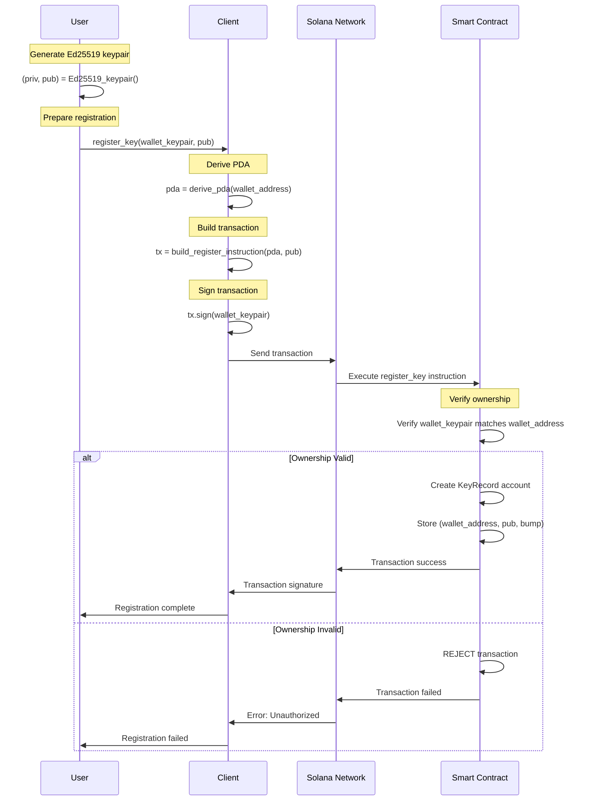
```mermaid
sequenceDiagram
    participant U as User
    participant C as Client
    participant S as Solana Network
    participant P as Smart Contract
    
    Note over U: Generate Ed25519 keypair
    U->>U: (priv, pub) = Ed25519_keypair()
    
    Note over U: Prepare registration
    U->>C: register_key(wallet_keypair, pub)
    
    Note over C: Derive PDA
    C->>C: pda = derive_pda(wallet_address)
    
    Note over C: Build transaction
    C->>C: tx = build_register_instruction(pda, pub)
    
    Note over C: Sign transaction
    C->>C: tx.sign(wallet_keypair)
    
    C->>S: Send transaction
    S->>P: Execute register_key instruction
    
    Note over P: Verify ownership
    P->>P: Verify wallet_keypair matches wallet_address
    
    alt Ownership Valid
        P->>P: Create KeyRecord account
        P->>P: Store (wallet_address, pub, bump)
        P->>S: Transaction success
        S->>C: Transaction signature
        C->>U: Registration complete
    else Ownership Invalid
        P->>P: REJECT transaction
        P->>S: Transaction failed
        S->>C: Error: Unauthorized
        C->>U: Registration failed
    end
```

### Key Verification Flow

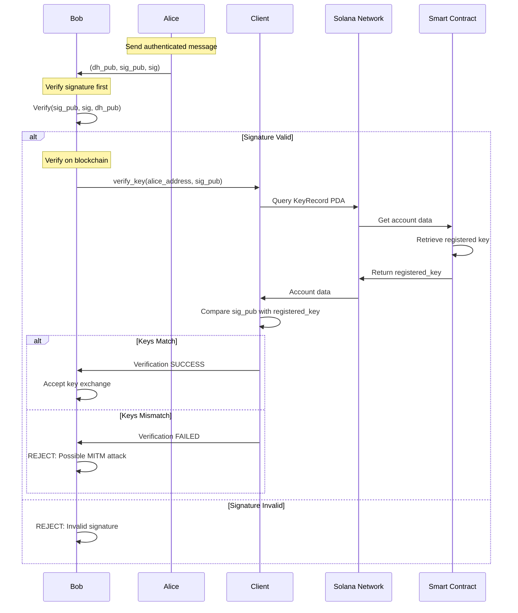
```mermaid
sequenceDiagram
    participant B as Bob
    participant A as Alice
    participant C as Client
    participant S as Solana Network
    participant P as Smart Contract
    
    Note over A: Send authenticated message
    A->>B: (dh_pub, sig_pub, sig)
    
    Note over B: Verify signature first
    B->>B: Verify(sig_pub, sig, dh_pub)
    alt Signature Valid
        Note over B: Verify on blockchain
        B->>C: verify_key(alice_address, sig_pub)
        C->>S: Query KeyRecord PDA
        S->>P: Get account data
        P->>P: Retrieve registered key
        P->>S: Return registered_key
        S->>C: Account data
        C->>C: Compare sig_pub with registered_key
        alt Keys Match
            C->>B: Verification SUCCESS
            B->>B: Accept key exchange
        else Keys Mismatch
            C->>B: Verification FAILED
            B->>B: REJECT: Possible MITM attack
        end
    else Signature Invalid
        B->>B: REJECT: Invalid signature
    end
```

### Smart Contract Architecture

```mermaid
graph TB
    subgraph "Smart Contract Instructions"
        Register[register_key<br/>Register new key]
        Update[update_key<br/>Update existing key]
        Verify[verify_key<br/>Verify key match]
    end
    
    subgraph "Account Structures"
        KeyRecord[KeyRecord Account<br/>owner: Pubkey<br/>public_key: [u8; 32]<br/>bump: u8]
    end
    
    subgraph "Security Checks"
        Ownership[Verify Wallet Ownership]
        PDA[PDA Derivation]
    end
    
    Register --> Ownership
    Register --> PDA
    Update --> Ownership
    Verify --> PDA
    Ownership --> KeyRecord
    PDA --> KeyRecord
```

### PDA Derivation

**Seeds:**
```rust
seeds = [b"key_record", owner_pubkey.as_ref()]
```

**Derivation:**
```rust
let (pda, bump) = Pubkey::find_program_address(seeds, program_id);
```

**Properties:**
- Deterministic: Same owner → Same PDA
- Unique: One PDA per owner
- Program-controlled: No private key needed

### Account Layout

```
KeyRecord Account (65 bytes total):
+------------------+
| Discriminator (8)|
+------------------+
| Owner (32)       |
+------------------+
| Public Key (32)  |
+------------------+
| Bump (1)         |
+------------------+
```

### Trust Model

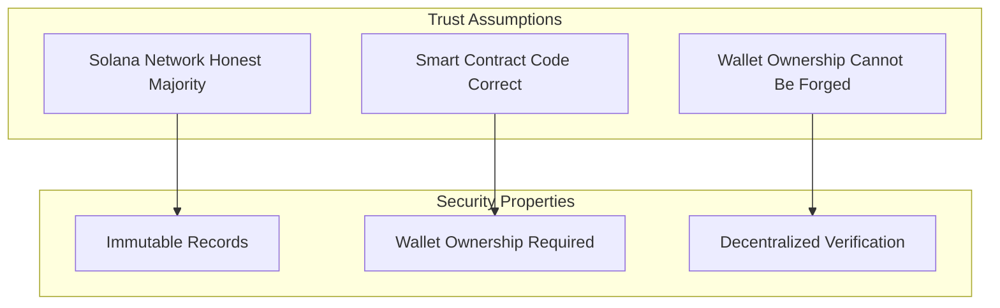
```mermaid
graph TB
    subgraph "Trust Assumptions"
        TA1[Solana Network Honest Majority]
        TA2[Smart Contract Code Correct]
        TA3[Wallet Ownership Cannot Be Forged]
    end
    
    subgraph "Security Properties"
        SP1[Immutable Records]
        SP2[Wallet Ownership Required]
        SP3[Decentralized Verification]
    end
    
    TA1 --> SP1
    TA2 --> SP2
    TA3 --> SP3
```

---

## Phase 6: Blockchain-Layer Attacks

### Attack Scenarios

This phase demonstrates four different attack strategies that Mallory might attempt against the blockchain-integrated system.

### Attack 1: Register Alice's Key with Alice's Address

**Strategy:** Mallory intercepts Alice's key and tries to register it for Alice's address.

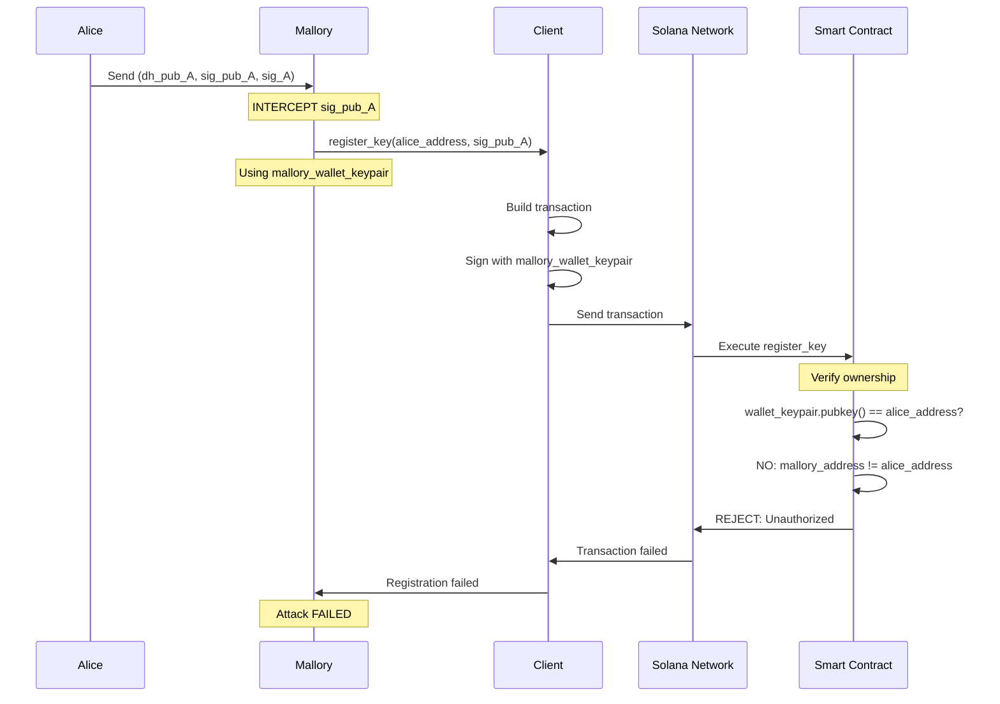
```mermaid
sequenceDiagram
    participant A as Alice
    participant M as Mallory
    participant C as Client
    participant S as Solana Network
    participant P as Smart Contract
    
    A->>M: Send (dh_pub_A, sig_pub_A, sig_A)
    Note over M: INTERCEPT sig_pub_A
    
    M->>C: register_key(alice_address, sig_pub_A)
    Note over M: Using mallory_wallet_keypair
    
    C->>C: Build transaction
    C->>C: Sign with mallory_wallet_keypair
    C->>S: Send transaction
    S->>P: Execute register_key
    
    Note over P: Verify ownership
    P->>P: wallet_keypair.pubkey() == alice_address?
    P->>P: NO: mallory_address != alice_address
    
    P->>S: REJECT: Unauthorized
    S->>C: Transaction failed
    C->>M: Registration failed
    
    Note over M: Attack FAILED
```

**Why It Fails:**
- Blockchain requires wallet owner to sign transaction
- Mallory's wallet address ≠ Alice's address
- Transaction rejected

### Attack 2: Register Own Key with Alice's Address

**Strategy:** Mallory tries to register her own key for Alice's address.

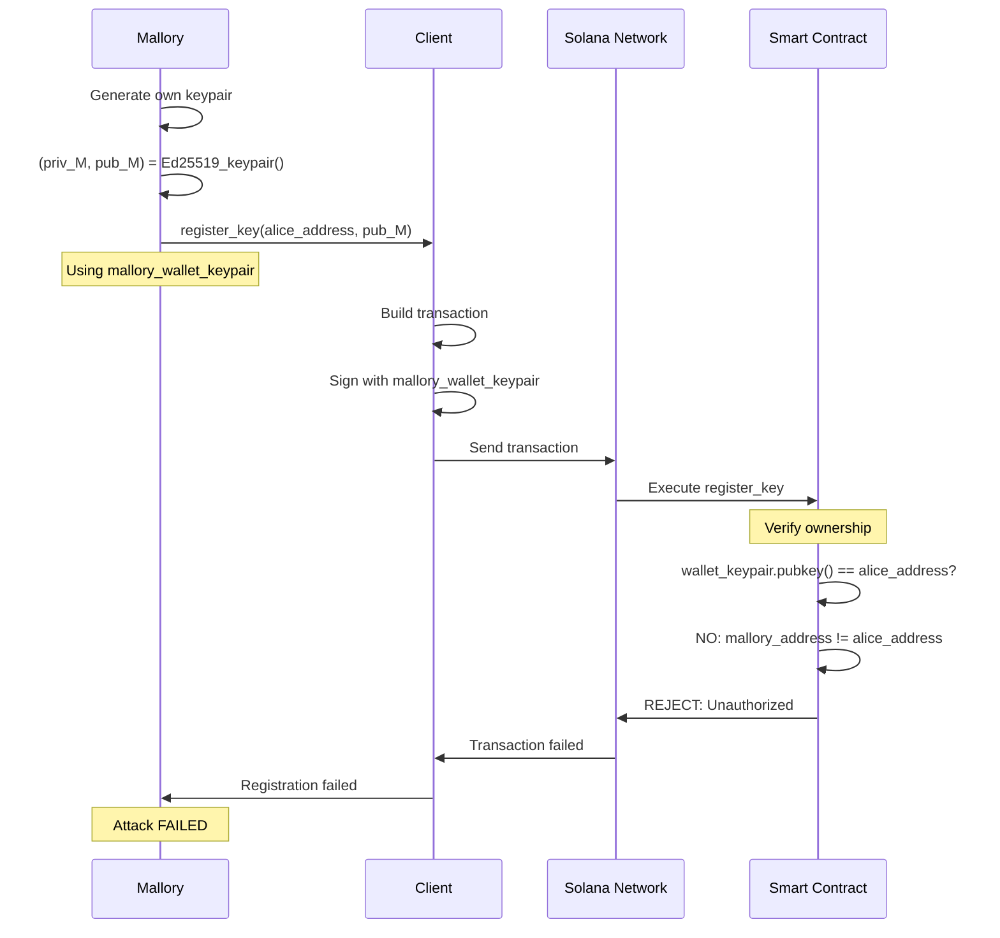
```mermaid
sequenceDiagram
    participant M as Mallory
    participant C as Client
    participant S as Solana Network
    participant P as Smart Contract
    
    M->>M: Generate own keypair
    M->>M: (priv_M, pub_M) = Ed25519_keypair()
    
    M->>C: register_key(alice_address, pub_M)
    Note over M: Using mallory_wallet_keypair
    
    C->>C: Build transaction
    C->>C: Sign with mallory_wallet_keypair
    C->>S: Send transaction
    S->>P: Execute register_key
    
    Note over P: Verify ownership
    P->>P: wallet_keypair.pubkey() == alice_address?
    P->>P: NO: mallory_address != alice_address
    
    P->>S: REJECT: Unauthorized
    S->>C: Transaction failed
    C->>M: Registration failed
    
    Note over M: Attack FAILED
```

**Why It Fails:**
- Same reason as Attack 1
- Only Alice can register keys for her address
- Wallet ownership is cryptographically enforced

### Attack 3: Use Alice's Key with Own Address

**Strategy:** Mallory intercepts Alice's key and tries to use it, claiming it's registered for her address.

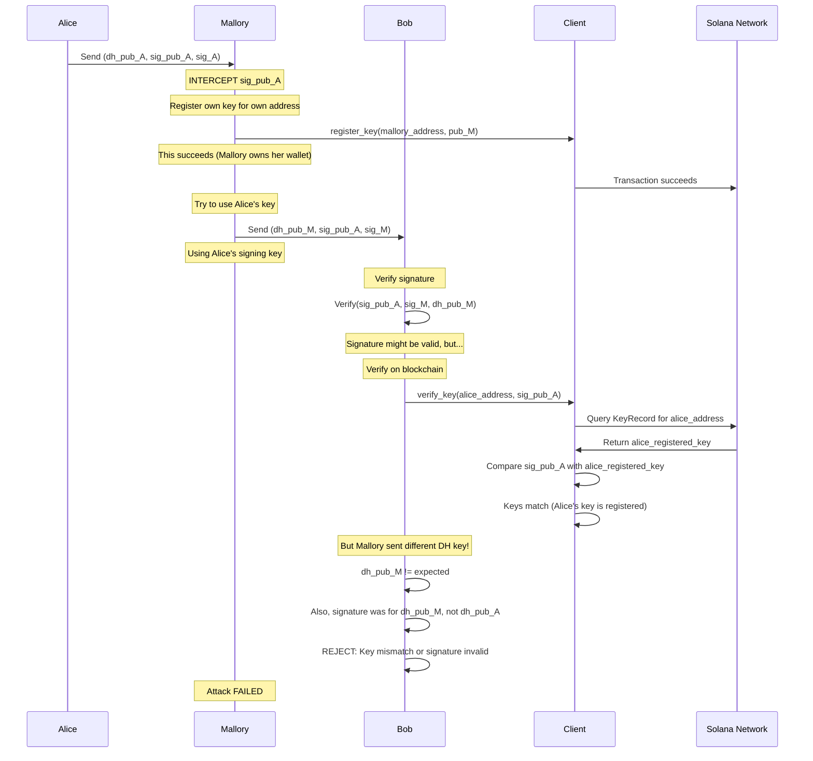
```mermaid
sequenceDiagram
    participant A as Alice
    participant M as Mallory
    participant B as Bob
    participant C as Client
    participant S as Solana Network
    
    A->>M: Send (dh_pub_A, sig_pub_A, sig_A)
    Note over M: INTERCEPT sig_pub_A
    
    Note over M: Register own key for own address
    M->>C: register_key(mallory_address, pub_M)
    Note over M: This succeeds (Mallory owns her wallet)
    C->>S: Transaction succeeds
    
    Note over M: Try to use Alice's key
    M->>B: Send (dh_pub_M, sig_pub_A, sig_M)
    Note over M: Using Alice's signing key
    
    Note over B: Verify signature
    B->>B: Verify(sig_pub_A, sig_M, dh_pub_M)
    Note over B: Signature might be valid, but...
    
    Note over B: Verify on blockchain
    B->>C: verify_key(alice_address, sig_pub_A)
    C->>S: Query KeyRecord for alice_address
    S->>C: Return alice_registered_key
    C->>C: Compare sig_pub_A with alice_registered_key
    C->>C: Keys match (Alice's key is registered)
    
    Note over B: But Mallory sent different DH key!
    B->>B: dh_pub_M != expected
    B->>B: Also, signature was for dh_pub_M, not dh_pub_A
    B->>B: REJECT: Key mismatch or signature invalid
    
    Note over M: Attack FAILED
```

**Why It Fails:**
- Bob verifies key on-chain for Alice's address
- Alice's address has Alice's key (different from Mallory's)
- Key mismatch detected → Attack prevented

### Attack 4: Register Fake Key for Own Address

**Strategy:** Mallory registers her own key for her own address (succeeds), but tries to use it in Alice-Bob communication.

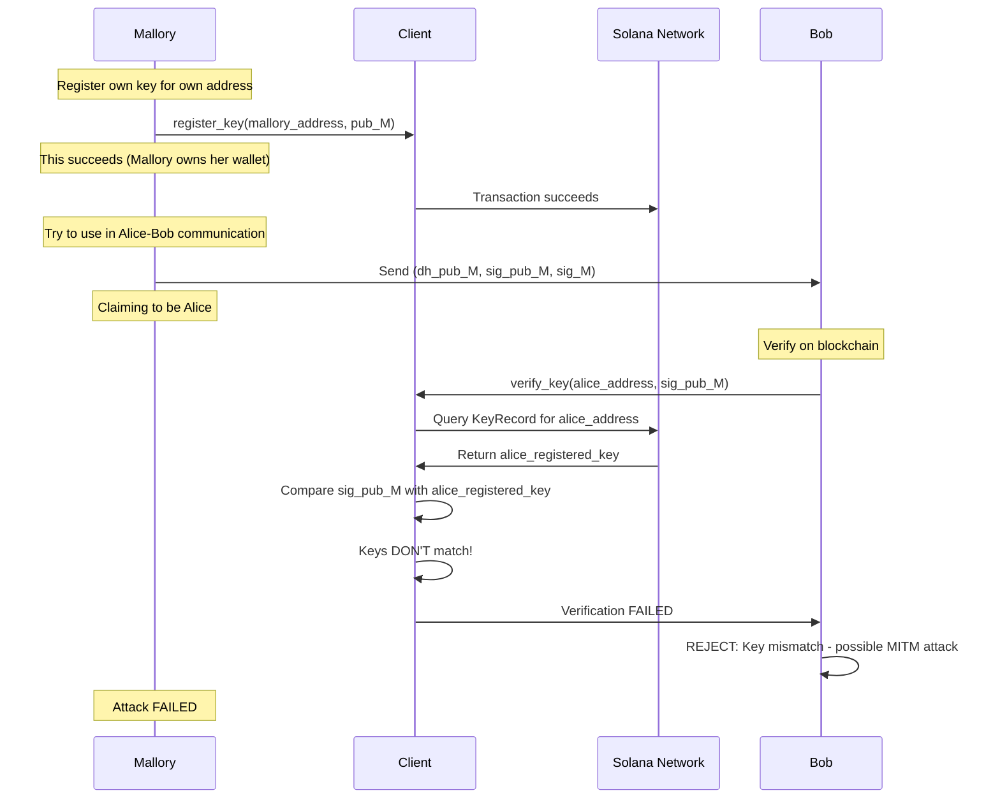
```mermaid
sequenceDiagram
    participant M as Mallory
    participant C as Client
    participant S as Solana Network
    participant B as Bob
    
    Note over M: Register own key for own address
    M->>C: register_key(mallory_address, pub_M)
    Note over M: This succeeds (Mallory owns her wallet)
    C->>S: Transaction succeeds
    
    Note over M: Try to use in Alice-Bob communication
    M->>B: Send (dh_pub_M, sig_pub_M, sig_M)
    Note over M: Claiming to be Alice
    
    Note over B: Verify on blockchain
    B->>C: verify_key(alice_address, sig_pub_M)
    C->>S: Query KeyRecord for alice_address
    S->>C: Return alice_registered_key
    C->>C: Compare sig_pub_M with alice_registered_key
    C->>C: Keys DON'T match!
    
    C->>B: Verification FAILED
    B->>B: REJECT: Key mismatch - possible MITM attack
    
    Note over M: Attack FAILED
```

**Why It Fails:**
- Registration succeeds (Mallory owns her wallet)
- But Bob verifies against Alice's address, not Mallory's
- Alice's address has different key → Mismatch detected

### Attack Prevention Summary

| Attack | Strategy | Prevention Mechanism | Result |
|--------|----------|---------------------|--------|
| Attack 1 | Register Alice's key with Alice's address | Wallet ownership requirement | ✅ Prevented |
| Attack 2 | Register own key with Alice's address | Address verification | ✅ Prevented |
| Attack 3 | Use Alice's key with own address | On-chain verification | ✅ Prevented |
| Attack 4 | Register fake key for own address | Address-based verification | ✅ Prevented |

---

## Protocol Comparison

### Security Properties by Phase

| Phase | Confidentiality | Integrity | Authentication | Non-Repudiation | MITM Prevention |
|-------|----------------|-----------|----------------|-----------------|----------------|
| Phase 1 | ❌ | ❌ | ❌ | ❌ | ❌ |
| Phase 2 | ❌ | ❌ | ❌ | ❌ | ❌ (Attack succeeds) |
| Phase 3 | ❌ | ✅ | ✅ | ✅ | ✅ |
| Phase 4 | ✅ | ✅ | ✅ | ✅ | ✅ |
| Phase 5 | ✅ | ✅ | ✅ | ✅ | ✅ |
| Phase 6 | ✅ | ✅ | ✅ | ✅ | ✅ (All attacks prevented) |

### Message Sizes

| Phase | Message Size | Components |
|-------|--------------|------------|
| Phase 1 | 32 bytes | DH public key |
| Phase 2 | 32 bytes | DH public key (same as Phase 1) |
| Phase 3 | 128 bytes | DH key (32) + Signing key (32) + Signature (64) |
| Phase 4 | Variable | Ciphertext (N+16) + Nonce (12) |
| Phase 5 | 128 bytes | Same as Phase 3 + blockchain verification |
| Phase 6 | 128 bytes | Same as Phase 5 |

### Computational Complexity

| Phase | Key Generation | Key Exchange | Signatures | Encryption | Blockchain |
|-------|---------------|--------------|------------|------------|------------|
| Phase 1 | O(1) | O(1) | - | - | - |
| Phase 2 | O(1) | O(1) | - | - | - |
| Phase 3 | O(1) | O(1) | O(1) | - | - |
| Phase 4 | O(1) | O(1) | O(1) | O(n) | - |
| Phase 5 | O(1) | O(1) | O(1) | O(n) | O(1) |
| Phase 6 | O(1) | O(1) | O(1) | - | O(1) |

### Unified Message Format Table

| Phase | Message Type | Total Size | Components | Encoding |
|-------|-------------|------------|------------|----------|
| **Phase 1** | DH Public Key | 32 bytes | `pub_key` (32) | Raw bytes |
| **Phase 2** | DH Public Key | 32 bytes | `pub_key` (32) | Raw bytes |
| **Phase 3** | Authenticated DH | 128 bytes | `dh_pub` (32) + `sig_pub` (32) + `signature` (64) | Raw bytes |
| **Phase 4** | AEAD Message | Variable | `ciphertext` (N+16) + `nonce` (12) + `aad` (optional) | Raw bytes |
| **Phase 5** | Authenticated DH + Verification | 128 bytes + Query | Same as Phase 3 + blockchain query | Raw bytes + JSON-RPC |
| **Phase 6** | Authenticated DH + Verification | 128 bytes + Query | Same as Phase 5 | Raw bytes + JSON-RPC |

**Message Field Details:**

| Field | Size | Phase | Purpose |
|-------|------|-------|---------|
| `dh_pub` | 32 bytes | 1-6 | X25519 public key for key exchange |
| `sig_pub` | 32 bytes | 3-6 | Ed25519 public key for signature verification |
| `signature` | 64 bytes | 3-6 | Ed25519 signature over `dh_pub` |
| `ciphertext` | N+16 bytes | 4-6 | Encrypted plaintext + Poly1305 tag |
| `nonce` | 12 bytes | 4-6 | Unique nonce for encryption |
| `aad` | Variable | 4-6 | Associated authenticated data |

### Failure Case Table

| Phase | Failure Scenario | Detection Method | Error Response | Recovery Action |
|-------|-----------------|------------------|---------------|----------------|
| **Phase 1** | Key mismatch | Key comparison | Keys differ error | Retry key exchange |
| **Phase 1** | Invalid public key | Key parsing | Invalid key format | Reject and log |
| **Phase 2** | MITM attack | Key comparison | Different keys detected | Attack succeeds (by design) |
| **Phase 3** | Invalid signature | Signature verification | `InvalidSignature` exception | Reject key exchange |
| **Phase 3** | Wrong signing key | Key mismatch | Signature verification fails | Reject key exchange |
| **Phase 3** | Key tampering | Signature verification | Signature invalid | Reject key exchange |
| **Phase 4** | Invalid tag | MAC verification | `InvalidTag` exception | Reject message |
| **Phase 4** | Nonce reuse | Nonce tracking | Security error | Abort session |
| **Phase 4** | Message tampering | MAC verification | `InvalidTag` exception | Reject message |
| **Phase 5** | Key not registered | Blockchain query | Account not found | Reject key exchange |
| **Phase 5** | Key mismatch | On-chain comparison | Keys don't match | Reject key exchange |
| **Phase 5** | Network error | RPC failure | Connection error | Retry or fail |
| **Phase 6** | Registry impersonation | Wallet ownership check | Unauthorized error | Attack prevented |
| **Phase 6** | Fake key registration | Address verification | Address mismatch | Attack prevented |
| **Phase 6** | Key substitution | On-chain verification | Key mismatch | Attack prevented |

**Error Handling Strategy:**

| Error Type | Phase | Handling | User Notification |
|------------|------|----------|------------------|
| Cryptographic errors | All | Exception raised | Error message displayed |
| Network errors | 5-6 | Retry with backoff | Connection error shown |
| Validation errors | All | Immediate rejection | Validation error shown |
| Attack detection | 2, 6 | Logged and prevented | Attack status shown |

---

**Next Document:** TECHNICAL_DOC_04_THREAT_MODEL.md

---

**Document Version:** 1.0  
**Last Updated:** December 2024

