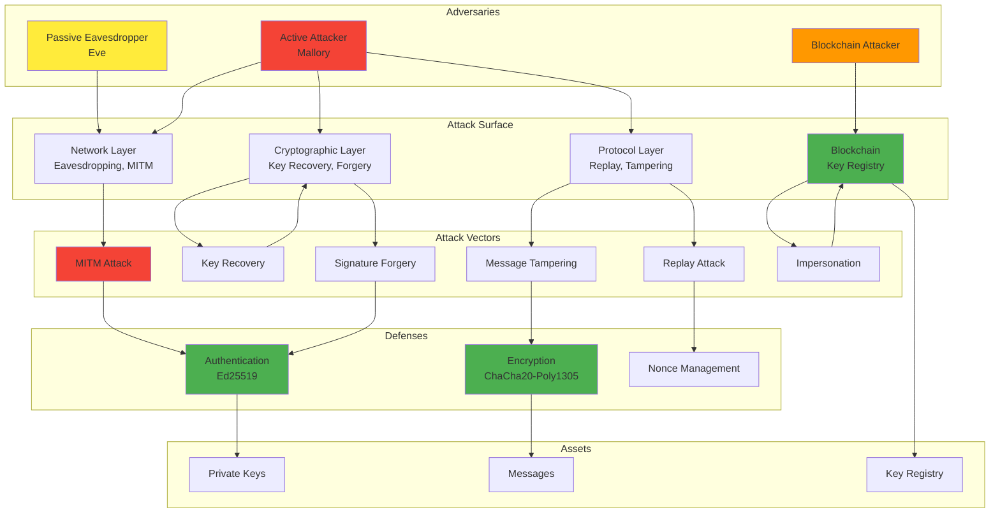

# Technical Documentation: Threat Model

**Secure Channel Project - Comprehensive Security Threat Analysis**

**Version:** 1.0  
**Date:** December 2024

---

## Table of Contents

1. [Threat Model Overview](#threat-model-overview)
2. [Assets](#assets)
3. [Adversaries](#adversaries)
4. [Adversary Capabilities](#adversary-capabilities)
5. [Attack Goals](#attack-goals)
6. [STRIDE Threat Analysis](#stride-threat-analysis)
7. [Attack Types](#attack-types)
8. [Blockchain-Specific Threats](#blockchain-specific-threats)
9. [Mitigation Strategies](#mitigation-strategies)
10. [Security Properties by Phase](#security-properties-by-phase)

---

## Threat Model Overview

This document provides a comprehensive threat model for the secure channel system, analyzing all potential attack vectors and their mitigations across all six phases.

### Threat Model Scope

- **In Scope:**
  - Network-level attacks (MITM, interception)
  - Cryptographic attacks (key recovery, signature forgery)
  - Blockchain attacks (impersonation, registry manipulation)
  - Protocol-level attacks (replay, tampering)

- **Out of Scope:**
  - Physical attacks (hardware compromise)
  - Side-channel attacks (timing, power analysis)
  - Social engineering
  - Implementation bugs in cryptography library

---

## Assets

### 1. Cryptographic Keys

**Private Keys:**
- X25519 private keys (ephemeral, for key exchange)
- Ed25519 private keys (long-term, for signatures)
- Solana wallet private keys (for blockchain transactions)
- Derived symmetric keys (for encryption)

**Value:** Critical - Compromise allows complete system compromise

**Protection:**
- Never transmitted over network
- Stored in memory only
- Generated using secure random number generator

### 2. Public Keys

**Public Keys:**
- X25519 public keys (for key exchange)
- Ed25519 public keys (for signature verification)
- Solana wallet addresses (for blockchain identity)

**Value:** High - Used for authentication and key exchange

**Protection:**
- Signed with Ed25519 (Phase 3+)
- Verified on blockchain (Phase 5+)
- Bound to identities

### 3. Shared Secrets

**Shared Secrets:**
- Raw shared secrets from DH exchange
- Derived symmetric keys (HKDF output)

**Value:** Critical - Used for encryption

**Protection:**
- Derived using HKDF (never use raw shared secret)
- Used only for encryption (not stored)
- Ephemeral (new key per session)

### 4. Encrypted Messages

**Messages:**
- Plaintext messages
- Encrypted ciphertexts
- Authentication tags

**Value:** High - Contains sensitive information

**Protection:**
- Encrypted with ChaCha20 (Phase 4+)
- Authenticated with Poly1305 (Phase 4+)
- Unique nonces prevent replay

### 5. Blockchain Records

**On-Chain Data:**
- Key registry entries
- Wallet addresses
- Transaction signatures

**Value:** High - Provides trust foundation

**Protection:**
- Immutable (blockchain property)
- Wallet ownership required
- Verifiable by anyone

---

## Adversaries

### 1. Passive Eavesdropper (Eve)

**Capabilities:**
- Can observe all network traffic
- Cannot modify messages
- Cannot inject messages

**Goals:**
- Learn shared secrets
- Decrypt messages
- Identify communication patterns

**Threat Level:** Medium (Phase 1-2), Low (Phase 3+)

### 2. Active Attacker (Mallory)

**Capabilities:**
- Can observe all network traffic
- Can modify messages
- Can inject messages
- Can intercept and replace messages

**Goals:**
- Perform MITM attacks
- Impersonate legitimate users
- Decrypt and modify messages

**Threat Level:** High (Phase 1-2), Low (Phase 3+)

### 3. Blockchain Attacker

**Capabilities:**
- Can observe blockchain transactions
- Can attempt to register keys
- Cannot forge wallet ownership
- Cannot modify blockchain history

**Goals:**
- Register fake keys
- Impersonate users
- Bypass key verification

**Threat Level:** Medium (Phase 5-6), but all attacks prevented

### 4. Compromised Participant

**Capabilities:**
- Has access to private keys
- Can sign messages
- Can decrypt messages

**Goals:**
- Impersonate user
- Access historical messages (if keys compromised)

**Threat Level:** Critical (if private keys compromised)

---

## Adversary Capabilities

### Network-Level Capabilities

| Capability | Description | Example |
|------------|-------------|---------|
| Eavesdrop | Observe network traffic | Read public keys in transit |
| Modify | Change messages | Replace public keys |
| Inject | Add new messages | Send fake public keys |
| Replay | Resend old messages | Reuse old nonces |
| Delay | Delay message delivery | Delay key exchange |

### Cryptographic Capabilities

| Capability | Description | Feasibility |
|------------|-------------|-------------|
| Key Recovery | Recover private keys from public keys | Computationally infeasible (X25519, Ed25519) |
| Signature Forgery | Create valid signatures without private key | Computationally infeasible (Ed25519) |
| MAC Forgery | Create valid MAC without key | Computationally infeasible (Poly1305) |
| Nonce Reuse | Reuse nonce with same key | Possible if implementation bug |

### Blockchain Capabilities

| Capability | Description | Feasibility |
|------------|-------------|-------------|
| Wallet Theft | Steal wallet private key | Possible (social engineering, malware) |
| Transaction Replay | Replay old transactions | Prevented by nonces/sequence numbers |
| Registry Manipulation | Modify on-chain records | Prevented by wallet ownership requirement |
| PDA Spoofing | Create fake PDAs | Prevented by deterministic derivation |

---

## Attack Goals

### Primary Goals

1. **Key Recovery**
   - Recover private keys
   - Derive shared secrets
   - Decrypt messages

2. **Impersonation**
   - Impersonate legitimate users
   - Bypass authentication
   - Establish unauthorized channels

3. **Message Tampering**
   - Modify messages in transit
   - Inject fake messages
   - Replay old messages

4. **Privacy Violation**
   - Learn message contents
   - Identify communication patterns
   - Track user behavior

### Secondary Goals

1. **Denial of Service**
   - Prevent key exchange
   - Block message delivery
   - Exhaust resources

2. **Information Leakage**
   - Learn public keys
   - Identify participants
   - Discover communication patterns

---

## STRIDE Threat Analysis

### STRIDE Framework

**S**poofing - Impersonating another user  
**T**ampering - Modifying data  
**R**epudiation - Denying actions  
**I**nformation Disclosure - Exposing sensitive data  
**D**enial of Service - Preventing legitimate use  
**E**levation of Privilege - Gaining unauthorized access

### STRIDE Matrix by Phase

| Threat | Phase 1 | Phase 2 | Phase 3 | Phase 4 | Phase 5 | Phase 6 |
|--------|---------|---------|---------|---------|---------|---------|
| **Spoofing** | ✅ Vulnerable | ✅ Attack succeeds | ✅ Prevented | ✅ Prevented | ✅ Prevented | ✅ Prevented |
| **Tampering** | ✅ Vulnerable | ✅ Attack succeeds | ✅ Prevented | ✅ Prevented | ✅ Prevented | ✅ Prevented |
| **Repudiation** | ✅ Possible | ✅ Possible | ✅ Prevented | ✅ Prevented | ✅ Prevented | ✅ Prevented |
| **Information Disclosure** | ✅ Vulnerable | ✅ Attack succeeds | ⚠️ Partial | ✅ Prevented | ✅ Prevented | ✅ Prevented |
| **Denial of Service** | ⚠️ Possible | ⚠️ Possible | ⚠️ Possible | ⚠️ Possible | ⚠️ Possible | ⚠️ Possible |
| **Elevation of Privilege** | ✅ Vulnerable | ✅ Attack succeeds | ✅ Prevented | ✅ Prevented | ✅ Prevented | ✅ Prevented |

### Detailed STRIDE Analysis

#### Spoofing

**Phase 1-2:**
- **Vulnerability:** No authentication
- **Attack:** Mallory can impersonate Alice or Bob
- **Impact:** Complete system compromise
- **Mitigation:** None (by design, to demonstrate vulnerability)

**Phase 3+:**
- **Vulnerability:** None
- **Attack:** Mallory cannot forge signatures
- **Impact:** None
- **Mitigation:** Ed25519 signatures prevent impersonation

#### Tampering

**Phase 1-2:**
- **Vulnerability:** No integrity protection
- **Attack:** Mallory can modify public keys
- **Impact:** MITM attack success
- **Mitigation:** None (by design)

**Phase 3:**
- **Vulnerability:** Messages not encrypted
- **Attack:** Mallory can read (but not modify) messages
- **Impact:** Privacy violation
- **Mitigation:** Signatures prevent key tampering

**Phase 4+:**
- **Vulnerability:** None
- **Attack:** Tampering detected by Poly1305 MAC
- **Impact:** None
- **Mitigation:** AEAD provides integrity protection

#### Repudiation

**Phase 1-2:**
- **Vulnerability:** No non-repudiation
- **Attack:** Users can deny sending messages
- **Impact:** Accountability loss
- **Mitigation:** None

**Phase 3+:**
- **Vulnerability:** None
- **Attack:** Signatures provide proof of origin
- **Impact:** None
- **Mitigation:** Ed25519 signatures + blockchain records

#### Information Disclosure

**Phase 1-2:**
- **Vulnerability:** Public keys visible
- **Attack:** Eve can observe key exchange
- **Impact:** Privacy violation
- **Mitigation:** None (public keys are meant to be public)

**Phase 3:**
- **Vulnerability:** Messages not encrypted
- **Attack:** Eve can read plaintext messages
- **Impact:** Privacy violation
- **Mitigation:** None (encryption added in Phase 4)

**Phase 4+:**
- **Vulnerability:** None
- **Attack:** Messages encrypted
- **Impact:** None
- **Mitigation:** ChaCha20 encryption provides confidentiality

#### Denial of Service

**All Phases:**
- **Vulnerability:** Network-level attacks possible
- **Attack:** Mallory can drop messages, delay delivery
- **Impact:** Service disruption
- **Mitigation:** Partial (timeouts, retries - not implemented)

#### Elevation of Privilege

**Phase 1-2:**
- **Vulnerability:** No access control
- **Attack:** Mallory can establish unauthorized channels
- **Impact:** Complete system compromise
- **Mitigation:** None

**Phase 3+:**
- **Vulnerability:** None
- **Attack:** Authentication prevents unauthorized access
- **Impact:** None
- **Mitigation:** Signatures + blockchain verification

---

## Attack Types

### 1. Man-in-the-Middle (MITM) Attack

**Description:** Attacker intercepts and modifies communication between two parties.

**Phases Affected:** Phase 1-2

**Attack Flow:**
1. Mallory positions herself between Alice and Bob
2. Intercepts Alice's public key
3. Replaces with her own fake key
4. Derives shared key with Alice
5. Repeats for Bob
6. Now Mallory shares keys with both parties

**Mitigation (Phase 3+):**
- Ed25519 signatures prevent key replacement
- Signature verification rejects fake keys
- Blockchain verification adds additional layer

### 2. Replay Attack

**Description:** Attacker resends old messages to cause unauthorized actions.

**Phases Affected:** All phases (to varying degrees)

**Attack Flow:**
1. Mallory captures encrypted message
2. Resends message later
3. Receiver processes duplicate message

**Mitigation:**
- Unique nonces prevent nonce reuse (Phase 4+)
- Timestamps or sequence numbers (not implemented)
- One-time use of nonces

### 3. Key Recovery Attack

**Description:** Attacker attempts to recover private keys from public keys.

**Phases Affected:** All phases

**Attack Flow:**
1. Mallory observes public keys
2. Attempts to compute private keys
3. Uses recovered keys to decrypt messages

**Mitigation:**
- X25519: Discrete logarithm problem (computationally infeasible)
- Ed25519: Elliptic curve discrete logarithm (computationally infeasible)
- No known polynomial-time attacks

### 4. Signature Forgery Attack

**Description:** Attacker attempts to create valid signatures without private key.

**Phases Affected:** Phase 3+

**Attack Flow:**
1. Mallory observes signed messages
2. Attempts to forge signatures
3. Uses forged signatures to impersonate users

**Mitigation:**
- Ed25519: Signature forgery is computationally infeasible
- Signature verification rejects invalid signatures
- Blockchain verification adds additional check

### 5. Message Tampering Attack

**Description:** Attacker modifies messages in transit.

**Phases Affected:** Phase 1-3

**Attack Flow:**
1. Mallory intercepts message
2. Modifies message content
3. Forwards modified message

**Mitigation (Phase 4+):**
- Poly1305 MAC detects tampering
- Invalid MAC causes message rejection
- Tampering is immediately detected

### 6. Nonce Reuse Attack

**Description:** Attacker causes nonce reuse, breaking encryption security.

**Phases Affected:** Phase 4+

**Attack Flow:**
1. Mallory causes nonce to be reused
2. Same nonce + same key = broken security
3. Can potentially decrypt messages

**Mitigation:**
- Nonce counter prevents reuse
- Random component adds entropy
- Implementation ensures uniqueness

---

## Blockchain-Specific Threats

### 1. Registry Impersonation

**Description:** Attacker attempts to register keys for addresses they don't own.

**Attack Flow:**
1. Mallory tries to register key for Alice's address
2. Uses her own wallet to sign transaction
3. Blockchain rejects (wallet mismatch)

**Mitigation:**
- Wallet ownership verification
- Transaction signature proves ownership
- Only wallet owner can register keys

### 2. Fake PDA Attack

**Description:** Attacker attempts to create fake Program Derived Addresses.

**Attack Flow:**
1. Mallory tries to derive PDA with wrong seeds
2. Attempts to use fake PDA
3. Blockchain rejects (invalid derivation)

**Mitigation:**
- Deterministic PDA derivation
- Seeds include owner address
- Program verifies PDA derivation

### 3. On-Chain Replay Attack

**Description:** Attacker replays old blockchain transactions.

**Attack Flow:**
1. Mallory captures old transaction
2. Replays transaction
3. Attempts to cause duplicate registration

**Mitigation:**
- Solana transaction nonces prevent replay
- Account state prevents duplicate registration
- Transaction signatures include recent blockhash

### 4. Stale Key Attack

**Description:** Attacker uses old, revoked keys.

**Attack Flow:**
1. Mallory obtains old key
2. Uses key after it's been updated
3. Attempts to establish channel with stale key

**Mitigation:**
- Blockchain always has latest key
- Verification checks current on-chain key
- Stale keys are rejected

### 5. Delayed Update Attack

**Description:** Attacker exploits race condition during key updates.

**Attack Flow:**
1. Alice updates her key on blockchain
2. Mallory uses old key before update propagates
3. Attempts to establish channel with old key

**Mitigation:**
- Blockchain provides eventual consistency
- Verification always checks latest state
- Race conditions are handled by blockchain consensus

### 6. Identity Hijacking

**Description:** Attacker steals wallet private key and registers new key.

**Attack Flow:**
1. Mallory steals Alice's wallet private key
2. Registers new Ed25519 key for Alice's address
3. Impersonates Alice

**Mitigation:**
- Wallet security is out of scope (user responsibility)
- If wallet compromised, attacker can register new key
- This is a fundamental limitation of any PKI system

---

## Mitigation Strategies

### Cryptographic Mitigations

| Threat | Mitigation | Implementation |
|--------|-----------|----------------|
| Key Recovery | Strong cryptographic primitives | X25519, Ed25519 |
| Signature Forgery | Digital signatures | Ed25519 |
| Message Tampering | Message authentication | Poly1305 MAC |
| Replay Attacks | Unique nonces | Nonce counter + random |
| Eavesdropping | Encryption | ChaCha20 |

### Protocol Mitigations

| Threat | Mitigation | Implementation |
|--------|-----------|----------------|
| MITM Attacks | Authentication | Ed25519 signatures |
| Impersonation | Identity verification | Blockchain registry |
| Key Tampering | Signature verification | Ed25519 verify |
| Non-repudiation | Signatures + blockchain | Ed25519 + Solana |

### Blockchain Mitigations

| Threat | Mitigation | Implementation |
|--------|-----------|----------------|
| Registry Impersonation | Wallet ownership | Transaction signatures |
| Fake PDAs | Deterministic derivation | PDA seeds |
| Replay Attacks | Transaction nonces | Solana blockhash |
| Stale Keys | On-chain verification | Always check latest state |

---

## Security Properties by Phase

### Phase 1: Basic Diffie-Hellman

**Security Properties:**
- ✅ Shared secret establishment
- ❌ No authentication
- ❌ No integrity protection
- ❌ No confidentiality

**Threats:**
- ✅ Vulnerable to MITM
- ✅ Vulnerable to key tampering
- ✅ Vulnerable to impersonation

### Phase 2: MITM Attack

**Security Properties:**
- Same as Phase 1 (demonstrates vulnerability)

**Threats:**
- ✅ MITM attack succeeds
- ✅ All Phase 1 threats apply

### Phase 3: Authenticated DH

**Security Properties:**
- ✅ Shared secret establishment
- ✅ Authentication (Ed25519)
- ✅ Integrity (signatures)
- ✅ Non-repudiation
- ❌ No message encryption

**Threats:**
- ✅ MITM prevented
- ✅ Impersonation prevented
- ⚠️ Messages still readable (not encrypted)

### Phase 4: Secure Channel

**Security Properties:**
- ✅ Shared secret establishment
- ✅ Authentication (Ed25519)
- ✅ Integrity (Poly1305)
- ✅ Confidentiality (ChaCha20)
- ✅ Non-repudiation
- ✅ Replay protection (nonces)

**Threats:**
- ✅ All previous threats prevented
- ✅ Complete secure channel

### Phase 5: Blockchain Integration

**Security Properties:**
- All Phase 4 properties +
- ✅ Decentralized key registry
- ✅ Immutable key records
- ✅ Wallet ownership verification

**Threats:**
- ✅ All previous threats prevented
- ✅ Blockchain attacks prevented

### Phase 6: Attack Prevention

**Security Properties:**
- All Phase 5 properties
- ✅ Verified attack prevention

**Threats:**
- ✅ All attacks prevented
- ✅ System fully secure

---

## Risk Assessment

### Risk Matrix

| Threat | Likelihood | Impact | Risk Level | Mitigation Status |
|--------|-----------|--------|------------|-------------------|
| MITM (Phase 1-2) | High | Critical | Critical | By design (demonstration) |
| MITM (Phase 3+) | Low | Critical | Low | ✅ Prevented |
| Key Recovery | Very Low | Critical | Very Low | ✅ Cryptographically secure |
| Signature Forgery | Very Low | High | Very Low | ✅ Ed25519 secure |
| Message Tampering | Medium (Phase 1-3) | High | Medium | ✅ Prevented (Phase 4+) |
| Replay Attack | Medium | Medium | Medium | ✅ Nonces prevent |
| Registry Impersonation | Low | High | Medium | ✅ Wallet ownership |
| DoS | Medium | Medium | Medium | ⚠️ Partial mitigation |

### Residual Risks

1. **Denial of Service**
   - Network-level attacks still possible
   - No rate limiting implemented
   - **Mitigation:** Add timeouts, retries, rate limiting

2. **Wallet Compromise**
   - If wallet private key stolen, attacker can register new key
   - Fundamental limitation of any PKI system
   - **Mitigation:** User education, hardware wallets

3. **Implementation Bugs**
   - Bugs in cryptography library
   - Bugs in our code
   - **Mitigation:** Code review, testing, use well-tested libraries

---

## Threat Landscape Diagram

### Complete Threat Model Visualization

### Threat Flow Analysis

**Attack Paths:**
1. **Network → MITM → Authentication**: Prevented by Ed25519 signatures
2. **Cryptographic → Key Recovery → Keys**: Prevented by cryptographic security
3. **Cryptographic → Forgery → Authentication**: Prevented by Ed25519 security
4. **Protocol → Tampering → Messages**: Prevented by Poly1305 MAC
5. **Protocol → Replay → Messages**: Prevented by unique nonces
6. **Blockchain → Impersonation → Registry**: Prevented by wallet ownership

---

## Residual Risk Table

### Comprehensive Residual Risk Assessment

| Risk ID | Risk Description | Likelihood | Impact | Risk Level | Current Mitigation | Residual Risk | Recommended Action |
|---------|-----------------|------------|--------|------------|-------------------|--------------|-------------------|
| **RR-001** | Denial of Service (Network) | Medium | Medium | Medium | None | Medium | Implement rate limiting, timeouts |
| **RR-002** | Wallet Private Key Theft | Low | Critical | Medium | User responsibility | Medium | Hardware wallets, key management |
| **RR-003** | Implementation Bugs | Low | High | Medium | Code review | Low | Security audits, testing |
| **RR-004** | Nonce Reuse (Implementation Error) | Very Low | Critical | Low | Counter + random | Very Low | Additional nonce tracking |
| **RR-005** | Blockchain Network Failure | Low | High | Medium | Retry mechanism | Low | Multiple RPC endpoints |
| **RR-006** | Key Rotation Not Implemented | N/A | Medium | Low | Not implemented | Low | Implement key rotation |
| **RR-007** | Key Revocation Not Implemented | N/A | Medium | Low | Not implemented | Low | Implement revocation |
| **RR-008** | Side-Channel Attacks | Very Low | High | Low | Out of scope | Low | Hardware security modules |
| **RR-009** | Social Engineering | Low | High | Medium | User education | Medium | Security training |
| **RR-010** | Compromised Cryptography Library | Very Low | Critical | Low | Use well-tested libraries | Very Low | Regular updates, monitoring |

### Risk Prioritization

**High Priority (Address Immediately):**
- None (all critical risks mitigated)

**Medium Priority (Address Soon):**
- RR-001: DoS protection
- RR-002: Wallet security
- RR-009: Social engineering

**Low Priority (Address When Possible):**
- RR-003: Implementation bugs (ongoing)
- RR-005: Blockchain redundancy
- RR-006: Key rotation
- RR-007: Key revocation

**Very Low Priority (Monitor):**
- RR-004: Nonce reuse
- RR-008: Side-channel attacks
- RR-010: Library compromise

### Risk Mitigation Roadmap

| Timeline | Risk ID | Action | Expected Outcome |
|----------|---------|--------|------------------|
| Immediate | RR-001 | Add rate limiting | DoS protection |
| Short-term | RR-002 | Document wallet security | User awareness |
| Short-term | RR-006 | Design key rotation | Key management |
| Medium-term | RR-007 | Implement revocation | Key lifecycle |
| Long-term | RR-003 | Security audit | Bug detection |

---

**Next Document:** TECHNICAL_DOC_05_CODE_DOCUMENTATION.md

---

**Document Version:** 1.0  
**Last Updated:** December 2024

