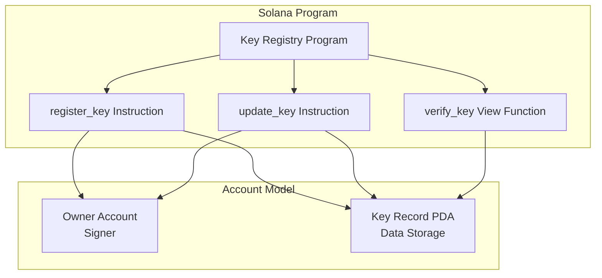
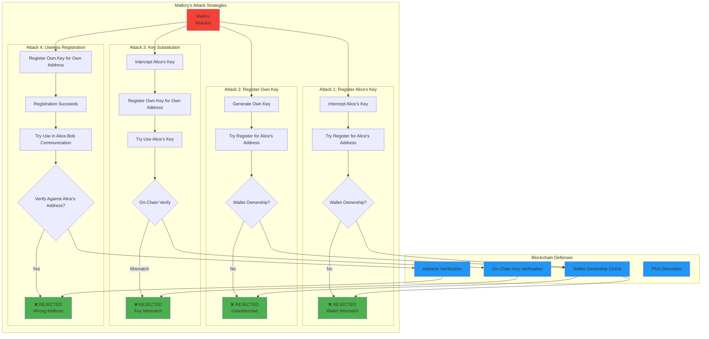
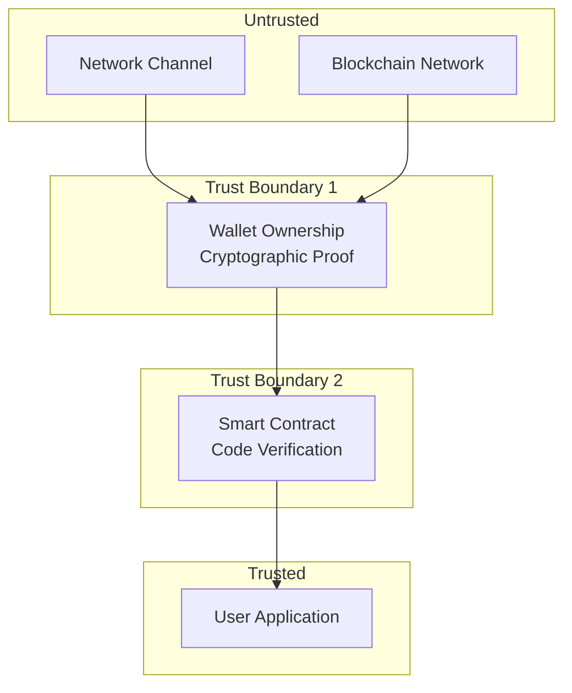

# Technical Documentation: Blockchain Integration & Attack Analysis

**Secure Channel Project - Blockchain Security Analysis**

**Version:** 1.0  
**Date:** December 2024

---

## Table of Contents

1. [Blockchain Architecture](#blockchain-architecture)
2. [Smart Contract Design](#smart-contract-design)
3. [Attack Scenarios](#attack-scenarios)
4. [Security Properties](#security-properties)
5. [Trust Model](#trust-model)
6. [Comparison with Traditional PKI](#comparison-with-traditional-pki)

---

## Blockchain Architecture

### Solana Network Integration

**Network Choice:** Solana Devnet (for development) / Mainnet (for production)

**Key Features:**
- High throughput (65,000+ TPS)
- Low latency (400ms block time)
- Low transaction fees (~$0.00025)
- Smart contract support (Anchor framework)

### Program Architecture



### PDA Derivation

**Seeds:**
```rust
seeds = [b"key_record", owner_pubkey.as_ref()]
```

**Properties:**
- Deterministic: Same owner → Same PDA
- Unique: One PDA per owner
- Program-controlled: No private key needed
- Immutable: PDA address never changes

---

## Smart Contract Design

### KeyRecord Account Structure

```rust
pub struct KeyRecord {
    pub owner: Pubkey,           // 32 bytes - Wallet address
    pub public_key: [u8; 32],    // 32 bytes - Ed25519 public key
    pub bump: u8,                // 1 byte - PDA bump seed
}
```

**Total Size:** 65 bytes (8-byte discriminator + 32 + 32 + 1)

### Instructions

#### register_key

**Purpose:** Register Ed25519 public key for wallet owner.

**Accounts:**
- `owner`: Signer (must own wallet)
- `key_record`: PDA to create
- `system_program`: For account creation

**Security Checks:**
- Owner must be signer
- PDA derivation verified
- Account initialized with correct data

#### update_key

**Purpose:** Update existing key registration.

**Security Checks:**
- Owner must match key_record.owner
- Only owner can update their key

#### verify_key

**Purpose:** Verify if key matches registered key.

**Returns:** `bool` - True if keys match

---

## Attack Scenarios

### Attack 1: Registry Impersonation

**Scenario:** Mallory tries to register Alice's key for Alice's address.

**Attack Flow:**
1. Mallory intercepts Alice's Ed25519 public key
2. Attempts to register it for Alice's address
3. Uses her own wallet to sign transaction

**Prevention:**
- Blockchain requires wallet owner to sign
- Mallory's wallet ≠ Alice's wallet
- Transaction rejected: "Unauthorized"

**Security Property:** Wallet Ownership Requirement

### Attack 2: Fake Key Registration

**Scenario:** Mallory tries to register her own key for Alice's address.

**Attack Flow:**
1. Mallory generates her own Ed25519 key
2. Attempts to register it for Alice's address
3. Uses her own wallet to sign transaction

**Prevention:**
- Same as Attack 1
- Wallet ownership verification prevents registration

**Security Property:** Address Verification

### Attack 3: Key Substitution

**Scenario:** Mallory intercepts Alice's key and tries to use it with her own address.

**Attack Flow:**
1. Mallory intercepts Alice's Ed25519 public key
2. Registers her own key for her own address (succeeds)
3. Tries to use Alice's key, claiming it's registered for her address

**Prevention:**
- Bob verifies key on-chain for Alice's address
- Finds: Alice's address has Alice's key (different)
- Key mismatch detected → Attack prevented

**Security Property:** On-Chain Verification

### Attack 4: Useless Registration

**Scenario:** Mallory registers her own key for her own address.

**Attack Flow:**
1. Mallory registers her own key for her own address
2. Registration succeeds (Mallory owns her wallet)
3. Tries to use this in Alice-Bob communication

**Prevention:**
- Registration works (expected)
- But Bob verifies against Alice's address, not Mallory's
- Alice's address has different key → Mismatch

**Security Property:** Address-Based Verification

### Mallory's Attack Path Diagram

The following diagram shows all four attack paths Mallory attempts and how each is prevented:



### Attack Path Analysis

**Attack 1 Path:**
```
Mallory → Intercept Key → Register for Alice's Address → Wallet Check → ❌ REJECTED
```

**Attack 2 Path:**
```
Mallory → Generate Key → Register for Alice's Address → Wallet Check → ❌ REJECTED
```

**Attack 3 Path:**
```
Mallory → Intercept Key → Register Own Key → Use Alice's Key → On-Chain Verify → ❌ REJECTED
```

**Attack 4 Path:**
```
Mallory → Register Own Key → Use in Communication → Address Verify → ❌ REJECTED
```

**All Paths Lead to Prevention:**
- Every attack path encounters a blockchain security check
- All checks result in attack rejection
- No successful attack path exists

---

## Security Properties

### Immutability

**Property:** Once registered, keys are on-chain permanently.

**Benefits:**
- Cannot retrospectively modify records
- Provides audit trail
- Historical records preserved

**Limitations:**
- Keys can be updated (but old records remain)
- No deletion (by design)

### Verifiability

**Property:** Anyone can verify keys on-chain.

**Benefits:**
- No need to trust third parties
- Transparent and auditable
- Decentralized verification

**Implementation:**
- Public blockchain
- Anyone can query KeyRecord accounts
- No authentication required for reading

### Wallet Ownership

**Property:** Only wallet owner can register/update keys.

**Benefits:**
- Cryptographic proof of ownership
- Cannot be forged
- Decentralized (no CA needed)

**Implementation:**
- Transaction signatures prove ownership
- Program verifies signer matches owner
- Rejects unauthorized transactions

### Deterministic PDAs

**Property:** PDA addresses are deterministically derived.

**Benefits:**
- Predictable addresses
- No key management needed
- Program-controlled accounts

**Security:**
- Seeds include owner address
- Prevents PDA spoofing
- Program verifies derivation

---

## Trust Model

### Trust Assumptions

1. **Solana Network**
   - Honest majority of validators
   - Network consensus is correct
   - No 51% attacks

2. **Smart Contract**
   - Code is correct (no bugs)
   - Program ID is authentic
   - Anchor framework is secure

3. **Wallet Security**
   - Users protect their private keys
   - No wallet compromise
   - Signatures are authentic

### Trust Boundaries



### Trust Evolution

| Component | Trust Model | Trust Level |
|-----------|------------|-------------|
| Phase 1-2 | None | ❌ No trust |
| Phase 3 | Signature-based | ⚠️ Partial |
| Phase 4 | Signature + AEAD | ✅ High |
| Phase 5-6 | Blockchain + Signature + AEAD | ✅✅ Very High |

---

## Comparison with Traditional PKI

### Traditional PKI

**Architecture:**
- Centralized Certificate Authority (CA)
- Certificate issuance and revocation
- Certificate chains
- Trust anchors

**Issues:**
- Single point of failure
- CA compromise affects all users
- Certificate revocation complexity
- Centralized control

### Blockchain-Based PKI

**Architecture:**
- Decentralized key registry
- Wallet ownership verification
- On-chain key records
- No central authority

**Benefits:**
- No single point of failure
- Wallet compromise is isolated
- Transparent and auditable
- Decentralized trust

### Comparison Table

| Aspect | Traditional PKI | Blockchain PKI |
|--------|-----------------|----------------|
| **Trust Model** | Centralized CA | Decentralized |
| **Single Point of Failure** | Yes (CA) | No |
| **Revocation** | Complex (CRL/OCSP) | Simple (update key) |
| **Transparency** | Limited | Full (public blockchain) |
| **Cost** | Certificate fees | Transaction fees |
| **Latency** | Low | Medium (blockchain) |
| **Scalability** | High | Medium (blockchain limits) |

---

## Security Analysis

### Attack Surface

**Network Layer:**
- Transaction interception (mitigated by signatures)
- Replay attacks (mitigated by nonces)
- DoS attacks (not fully mitigated)

**Smart Contract Layer:**
- Program bugs (mitigated by code review)
- PDA spoofing (mitigated by deterministic derivation)
- Unauthorized access (mitigated by ownership checks)

**Wallet Layer:**
- Key theft (user responsibility)
- Phishing (user education)
- Malware (user security)

### Security Guarantees

**Provided:**
- ✅ Wallet ownership cannot be forged
- ✅ Keys cannot be registered without ownership
- ✅ On-chain records are immutable
- ✅ Verification is decentralized

**Not Provided:**
- ❌ Wallet key security (user responsibility)
- ❌ DoS protection (network-level)
- ❌ Key revocation (not implemented)
- ❌ Key rotation (not implemented)

---

## Recommendations

### For Production Use

1. **Key Rotation**: Implement key update mechanism
2. **Revocation**: Add key revocation support
3. **Rate Limiting**: Add DoS protection
4. **Monitoring**: Add on-chain event monitoring
5. **Auditing**: Regular security audits

### For Educational Use

1. **Simulation**: Current simulated blockchain is sufficient
2. **Documentation**: Current documentation is comprehensive
3. **Examples**: Current examples demonstrate concepts well

---

**Document Series Complete**

---

**Document Version:** 1.0  
**Last Updated:** December 2024

